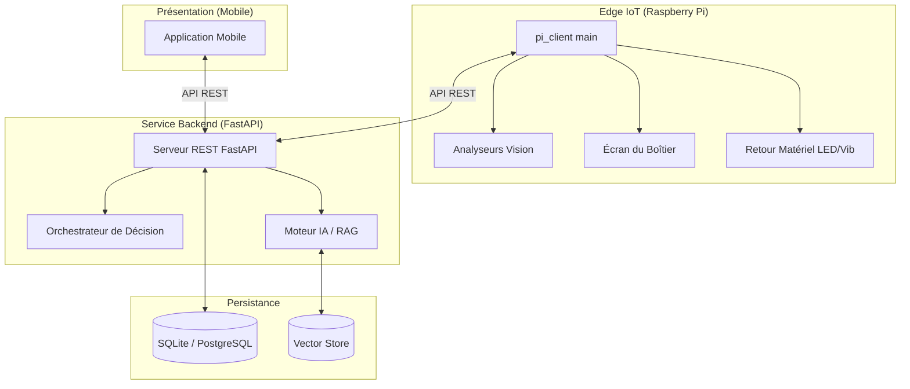

# 01 - Architecture Globale

## Diagramme de Composants Premium (Vue 3D)

## Diagramme de Composants (Technique)
Le système suit une architecture distribuée avec trois niveaux principaux : Edge IoT, Service Backend et Couche de Présentation.

## Diagramme de Déploiement
- **Appareil Edge** : Raspberry Pi avec Caméra, Micro, Écran local et composants de feedback.
- **Serveur** : Machine locale ou instance cloud exécutant FastAPI et la Base de Données.
- **Client Mobile** : Smartphone avec l'Application Mobile connectée à l'API.

## Flux de Données (Session de Focus)
1. **Capture** : `pi_client` capture les images vidéo et les données des capteurs.
2. **Analyse Edge** : Les analyseurs locaux calculent les scores (0.0 à 1.0) pour la Posture, la Fatigue, le Stress et l'Attention.
3. **Action Locale** : Si des seuils critiques sont atteints (ex: Fatigue > 0.8), les alertes matérielles locales et sur l'**écran du boîtier** sont déclenchées immédiatement.
4. **Transmission** : Les métriques et les événements sont envoyés au Backend via des requêtes POST.
5. **Persistance** : Le Backend enregistre les journaux dans la BD.
6. **Visualisation** : L'utilisateur consulte les données en temps réel ou l'historique sur l'**application mobile**.
7. **Interaction IA** : L'utilisateur interroge le chatbot via l'application mobile pour l'aide à la planification ou à l'étude ; le moteur RAG récupère le contexte de la session dans la BD et le vector store.
