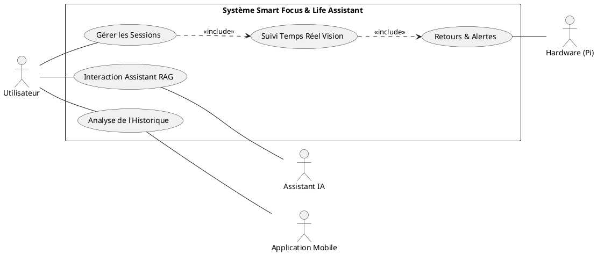
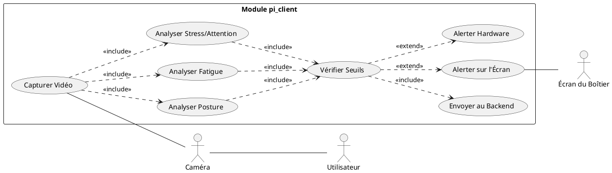
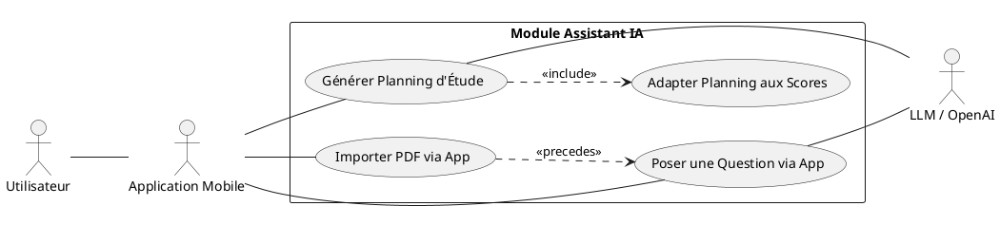

# 02 - Analyse Détaillée des Cas d'Utilisation

## 1. Cas d'Utilisation Global (Macro)

Ce diagramme présente les interactions de haut niveau entre les acteurs et le système.

## 2. Cas d'Utilisation : Module pi_client (Foyer de Vision)

C'est ici que se concentre la logique de capture et d'analyse locale sur le Raspberry Pi.

## 3. Cas d'Utilisation : Module Assistant IA (RAG)

Interaction entre l'utilisateur via l'application mobile, ses documents et l'IA.

