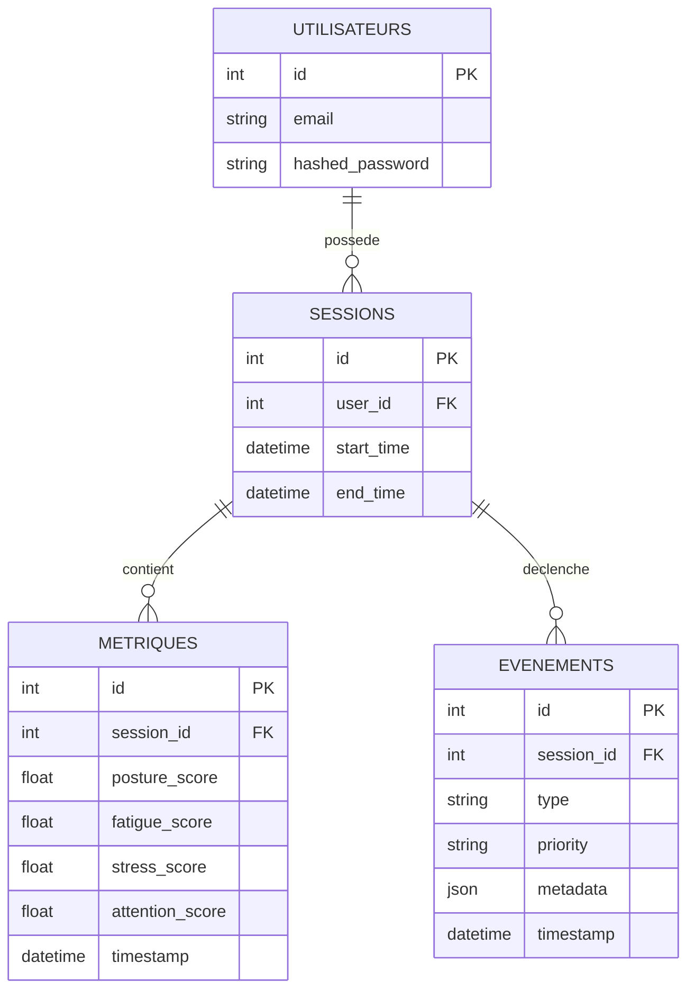

# 05 - Conception Détaillée de la Base de Données

## Schéma Relationnel (Modèle Physique)

### Table : `utilisateurs` (users)
| Colonne | Type | Contraintes | Description |
| --- | --- | --- | --- |
| `id` | INTEGER | PK, AI | Identifiant unique de l'utilisateur. |
| `email` | VARCHAR(255) | UNIQUE, NOT NULL | Adresse email (identifiant de connexion). |
| `hashed_password` | VARCHAR(255) | NOT NULL | Mot de passe sécurisé (hash). |
| `created_at` | DATETIME | DEFAULT NOW() | Date de création du compte. |

### Table : `sessions`
| Colonne | Type | Contraintes | Description |
| --- | --- | --- | --- |
| `id` | INTEGER | PK, AI | Identifiant de la session. |
| `user_id` | INTEGER | FK (utilisateurs.id) | Propriétaire de la session. |
| `start_time` | DATETIME | NOT NULL | Début de la session de focus. |
| `end_time` | DATETIME | | Fin de la session de focus. |
| `status` | VARCHAR(50) | | État (active, terminée, suspendue). |

### Table : `metriques` (metrics)
| Colonne | Type | Contraintes | Description |
| --- | --- | --- | --- |
| `id` | INTEGER | PK, AI | Identifiant unique. |
| `session_id` | INTEGER | FK (sessions.id) | Session associée. |
| `posture_score` | FLOAT | 0.0 - 1.0 | Score de posture. |
| `fatigue_score` | FLOAT | 0.0 - 1.0 | Score de fatigue. |
| `stress_score` | FLOAT | 0.0 - 1.0 | Score de stress (agitation). |
| `attention_score` | FLOAT | 0.0 - 1.0 | Score d'attention. |
| `timestamp` | DATETIME | NOT NULL | Horodatage de l'échantillon. |

### Table : `evenements` (events)
| Colonne | Type | Contraintes | Description |
| --- | --- | --- | --- |
| `id` | INTEGER | PK, AI | Identifiant de l'événement. |
| `session_id` | INTEGER | FK (sessions.id) | Session associée. |
| `type` | VARCHAR(50) | NOT NULL | Type d'alerte (FATIGUE_HIGH, etc). |
| `priority` | VARCHAR(20) | | Priorité (LOW, MEDIUM, HIGH). |
| `metadata` | JSON | | Détails techniques (ex: eye_closure). |
| `timestamp` | DATETIME | NOT NULL | Horodatage du déclenchement. |

---

## Normalisation de la Base de Données

### 1ère Forme Normale (1NF)
- Tous les attributs sont atomiques (pas de listes ou de groupes répétitifs).
- Les métadonnées JSON dans `evenements` sont acceptées pour la flexibilité des différents types d'IA, mais les champs clés sont séparés.

### 2ème Forme Normale (2NF)
- La base est en 1NF.
- Toutes les colonnes dépendent entièrement de la clé primaire de leur table respective.
- Les métriques sont isolées des informations de session pour éviter la redondance.

### 3ème Forme Normale (3NF)
- La base est en 2NF.
- Il n'y a aucune dépendance transitive. Les informations de l'utilisateur (email) ne sont pas stockées dans la table `metriques`, seulement via la clé étrangère `user_id` dans `sessions`.

---

## Diagramme ERD (Visualisation)

