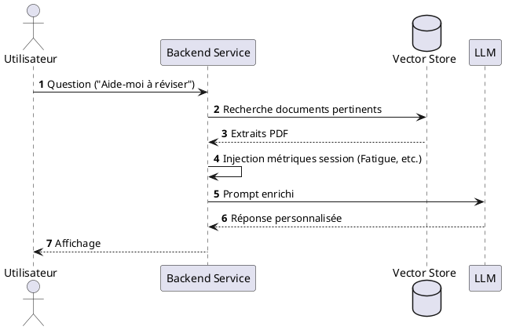

# 06 - Modules d'Intelligence Artificielle & RAG

## Architecture de l'Assistant
L'assistant utilise une approche **RAG (Retrieval-Augmented Generation)** couplée aux données biométriques en temps réel issues du `pi_client`.

### Flux de Séquence IA
Le diagramme suivant détaille comment une question utilisateur est enrichie par le contexte des documents et les métadonnées de session.

## Intégration des Métriques
Contrairement à un chatbot classique, Smart Focus injecte les scores de l'utilisateur :
- **Si fatigue > 0.7** : Le chatbot suggère une session de révision courte ou une pause.
- **Si posture < 0.5** : Le chatbot intègre des rappels ergonomiques dans ses réponses.

## Vector Store
- **Technologie** : ChromaDB ou FAISS.
- **Documents** : Supports de cours (PDF), notes (Markdown), guides de bien-être.
