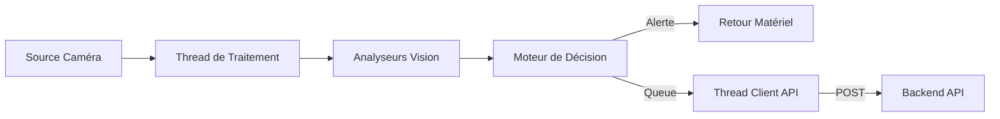

# 07 - Module IoT : pi_client (Zoom Technique)

## Schéma Visuel du Pipeline


## Architecture du Pipeline
Le `pi_client` fonctionne sur un modèle producteur-consommateur pour maintenir un FPS constant même en cas de latence réseau.



## Normalisation (Scores 0.0 à 1.0)
| Analyseur | Métrique | Signification 0.0 | Signification 1.0 |
| --- | --- | --- | --- |
| **Posture** | `posture_score` | Alignement parfait. | Avachissement sévère. |
| **Fatigue** | `fatigue_score` | Yeux ouverts, clignements normaux. | Yeux fermés (micro-sommeil). |
| **Attention**| `attention_score`| Regard centré. | Regard fuyant / Distrait. |
| **Stress** | `stress_score` | Calme, gestes contrôlés. | Agitation, gestes rapides. |

## Squelette de Code (Détails d'Implémentation)
### `decision_engine.py`
```python
class DecisionEngine:
    def __init__(self, thresholds):
        self.thresholds = thresholds

    def process(self, metrics):
        if metrics['fatigue'] > self.thresholds['fatigue_limit']:
            self.trigger_alert("FATIGUE_HIGH")
            return "ALARME"
        return "OK"
```

## Stratégie Hors-ligne
Le `api_client` utilise un tampon local SQLite ou CSV si le backend est injoignable, synchronisant les données une fois la connexion rétablie.
