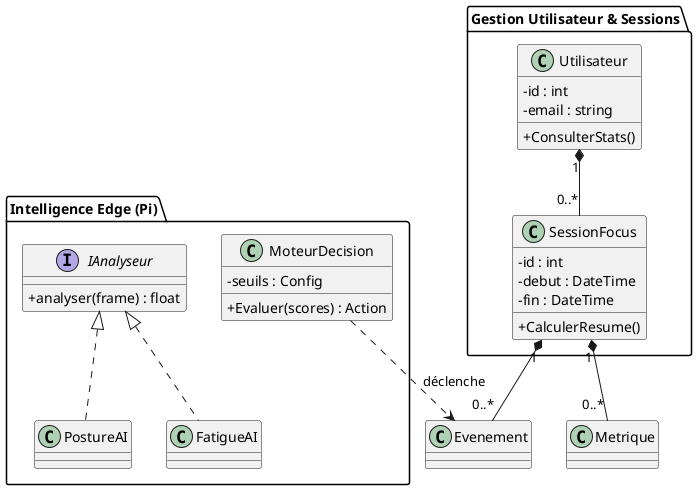

# 09 - Diagramme de Classes

Le diagramme de classes ci-dessous représente le modèle de domaine du système "Smart Focus & Life Assistant". Il met en évidence la séparation entre les entités de gestion (Utilisateur, Session) et les composants d'analyse temps réel (Analyseurs Vision, Moteur de Décision).

## Modèle de Domaine

## Explications des Relations
1. **Composition (1..*)** : Un utilisateur possède plusieurs sessions. Si l'utilisateur est supprimé, ses sessions le sont également (selon la politique métier).
2. **Interface IAnalyseur** : Permet d'ajouter facilement de nouveaux types d'analyseurs (ex: émotion, lumière ambiante) sans modifier le pipeline principal.
3. **Moteur de Décision** : Il agit comme le cerveau local sur le Pi, transformant les scores bruts en événements métier (alertes).
