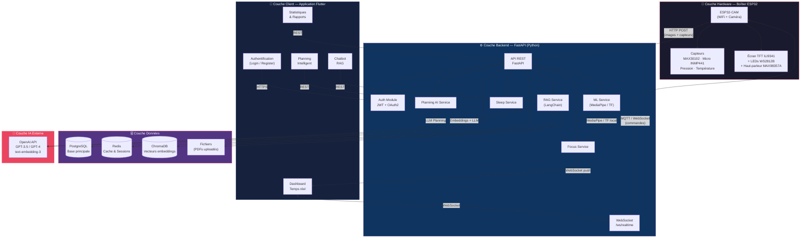
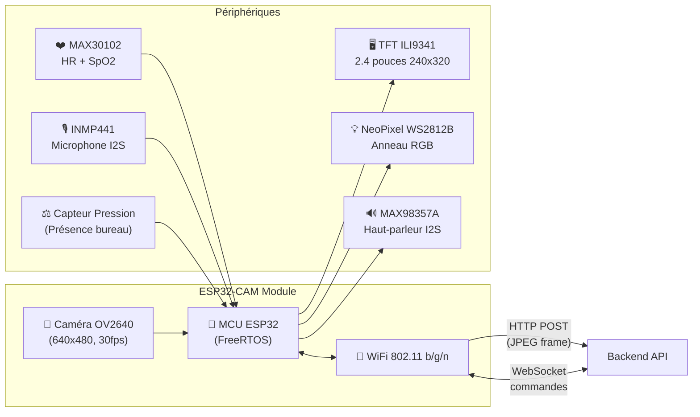
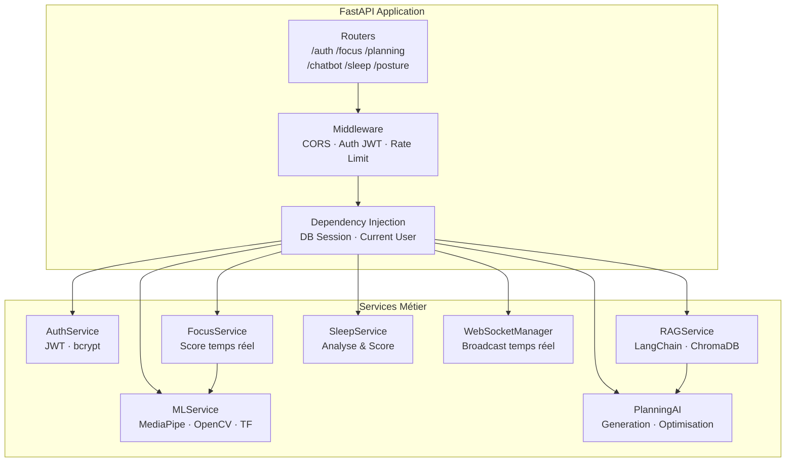
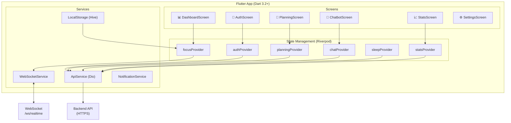

# 🏗️ Diagramme d'Architecture Système – Smart Focus & Life Assistant

**Version** : 1.0  
**Date** : 01 Mars 2026  
**Phase** : Conception  

---

## 1. Architecture Globale (Vue d'ensemble)

---

## 2. Architecture par Couche (Détail)

### 2.1 🔧 Couche Hardware (ESP32)

### 2.2 ⚙️ Couche Backend (FastAPI)

### 2.3 📱 Couche Application Flutter

