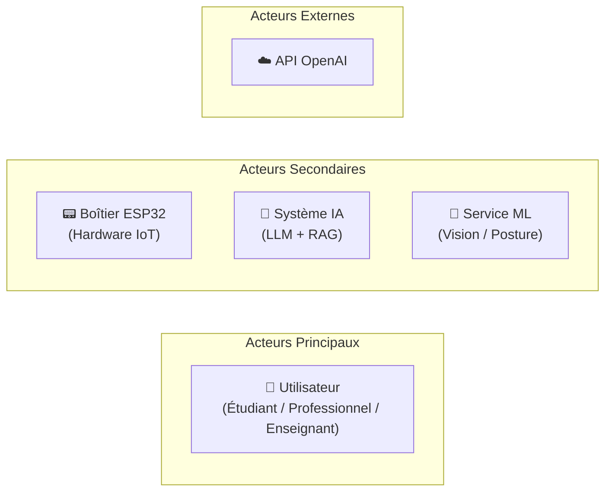
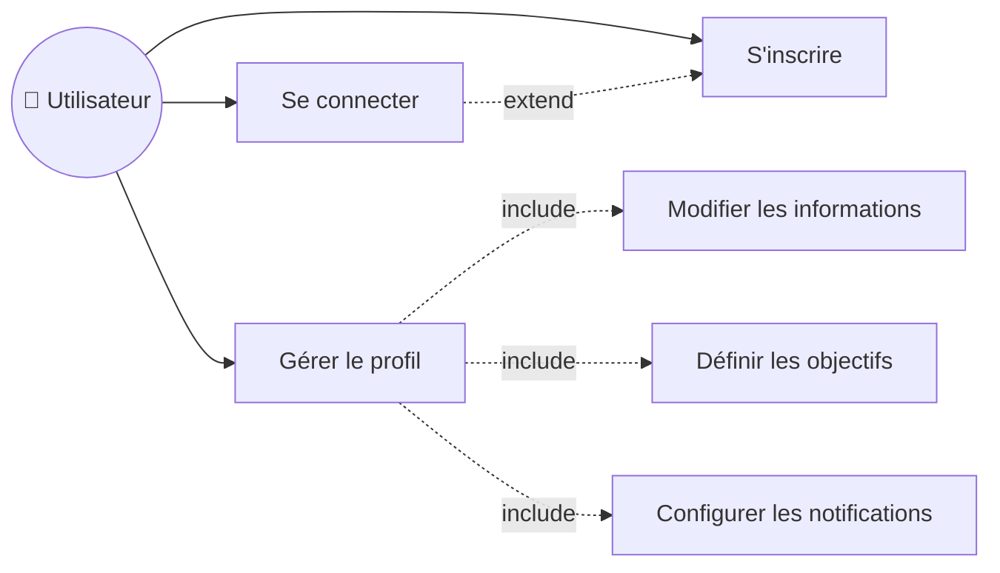

# 📐 Diagrammes de Cas d'Utilisation – Smart Focus & Life Assistant

**Version** : 1.0   
**Date** : 17 Février 2026  
**Phase** : Conception  

---

## 1. Identification des Acteurs

--- 

## 2. Diagramme de Cas d'Utilisation Général

```mermaid
graph TB
    %% Acteurs
    User(("👤 Utilisateur"))
    ESP32(("📟 ESP32"))
    IA(("🤖 IA / LLM"))
    ML(("🧠 ML Vision"))

    %% CU Authentification
    subgraph AUTH ["🔐 Authentification"]
        UC1["S'inscrire"]
        UC2["Se connecter"]
        UC3["Gérer le profil"]
    end

    %% CU Focus
    subgraph FOCUS ["🎯 Focus & Concentration"]
        UC4["Démarrer une session de travail"]
        UC5["Consulter le score de focus en temps réel"]
        UC6["Recevoir des alertes de concentration"]
        UC7["Consulter l'historique des sessions"]
    end

    %% CU Planning
    subgraph PLANNING ["📅 Planning Intelligent"]
        UC8["Consulter le planning du jour"]
        UC9["Générer un planning intelligent"]
        UC10["Modifier une session planifiée"]
        UC11["Supprimer une session planifiée"]
    end

    %% CU Chatbot
    subgraph CHATBOT ["💬 Chatbot RAG"]
        UC12["Uploader un document PDF"]
        UC13["Poser une question sur les cours"]
        UC14["Générer un quiz"]
        UC15["Créer des flashcards"]
        UC16["Planifier les révisions"]
    end

    %% CU Posture
    subgraph POSTURE ["🧍 Posture & Ergonomie"]
        UC17["Détecter la posture en temps réel"]
        UC18["Recevoir des alertes posture"]
        UC19["Consulter les statistiques posture"]
        UC20["Recevoir des conseils ergonomiques"]
    end

    %% CU Sommeil
    subgraph SOMMEIL ["🌙 Sommeil & Réveil"]
        UC21["Enregistrer les données de sommeil"]
        UC22["Consulter le score de sommeil"]
        UC23["Configurer le réveil intelligent"]
        UC24["Adapter le planning selon le sommeil"]
    end

    %% CU Stress
    subgraph STRESS ["🧘 Gestion du Stress"]
        UC25["Lancer un exercice de respiration"]
        UC26["Recevoir des suggestions de micro-pauses"]
    end

    %% CU Statistiques
    subgraph STATS ["📊 Statistiques & Conseils"]
        UC27["Consulter le dashboard global"]
        UC28["Voir les statistiques hebdomadaires"]
        UC29["Recevoir des conseils personnalisés"]
    end

    %% Relations Utilisateur
    User --> UC1
    User --> UC2
    User --> UC3
    User --> UC4
    User --> UC5
    User --> UC7
    User --> UC8
    User --> UC9
    User --> UC10
    User --> UC11
    User --> UC12
    User --> UC13
    User --> UC14
    User --> UC15
    User --> UC16
    User --> UC17
    User --> UC19
    User --> UC21
    User --> UC22
    User --> UC23
    User --> UC25
    User --> UC27
    User --> UC28

    %% Relations ESP32
    ESP32 --> UC6
    ESP32 --> UC17
    ESP32 --> UC18
    ESP32 --> UC21

    %% Relations IA
    IA --> UC9
    IA --> UC13
    IA --> UC14
    IA --> UC15
    IA --> UC16
    IA --> UC20
    IA --> UC24
    IA --> UC29

    %% Relations ML
    ML --> UC5
    ML --> UC6
    ML --> UC17
    ML --> UC18
    ML --> UC26
```

---

## 3. Cas d'Utilisation Détaillés par Module

### 3.1 🔐 Module Authentification

