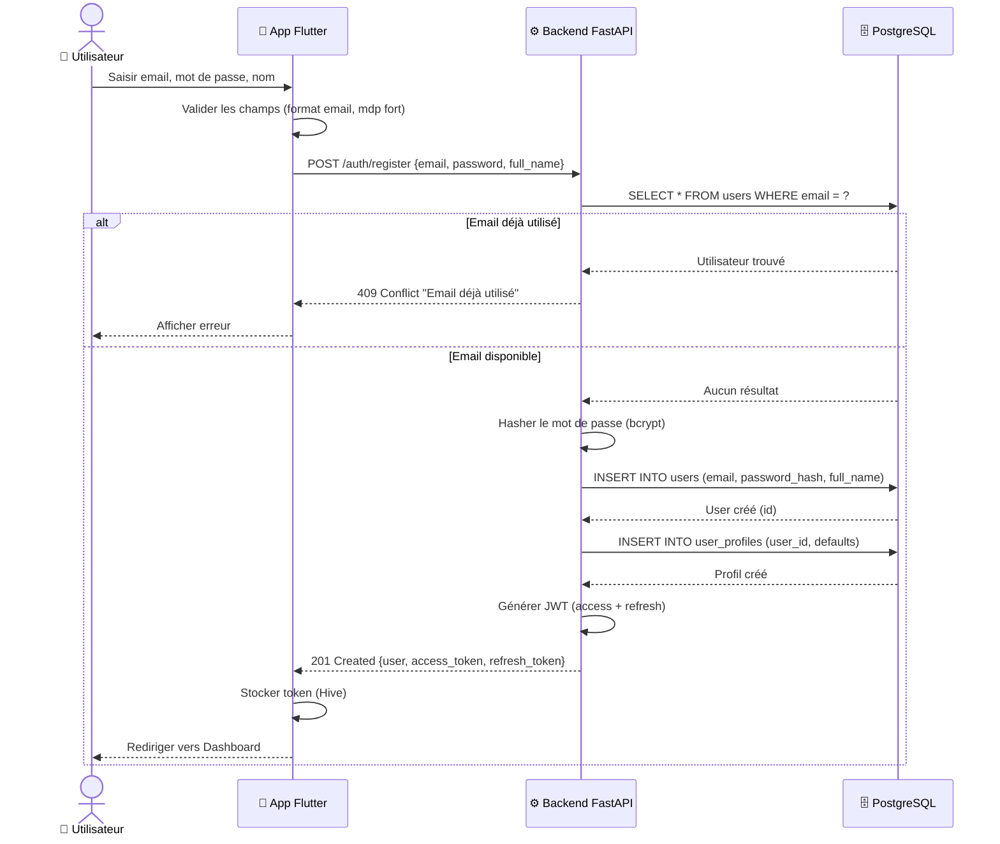
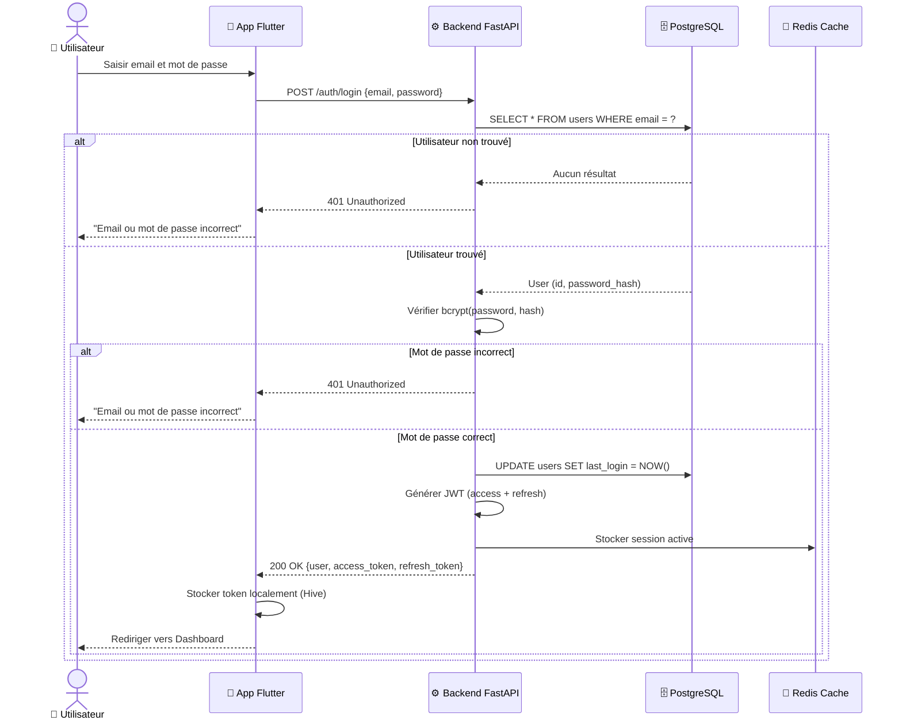

# 📐 Diagrammes de Séquence – Smart Focus & Life Assistant

**Version** : 1.0  
**Date** : 18 Février 2026  
**Phase** : Conception  

---

## 1. 🔐 Module Authentification

### 1.1 Inscription (UC1)

### 1.2 Connexion (UC2)

