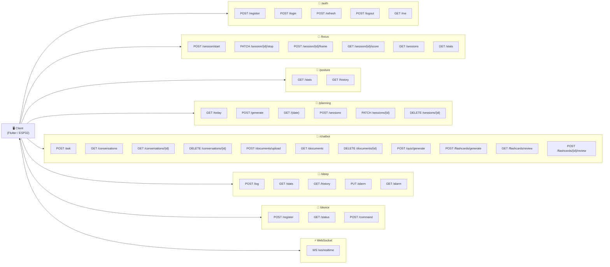

# 🌐 Diagramme des Endpoints API – Smart Focus & Life Assistant

**Version** : 1.0  
**Date** : 01 Mars 2026  
**Base URL** : `http://localhost:8000/api/v1`  
**Framework** : FastAPI + OpenAPI (Swagger auto-généré)

---

## 1. Vue Globale des Endpoints

