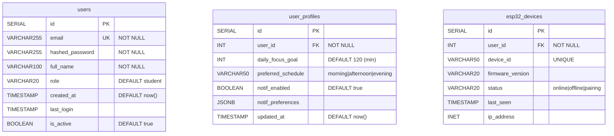

# 🗄️ Schéma Base de Données PostgreSQL (ERD) – Smart Focus & Life Assistant

**Version** : 1.0  
**Date** : 01 Mars 2026  
**Phase** : Conception  
**SGBD** : PostgreSQL 15+  

---

## 1. ERD Global (Mermaid)

(Note: ERD partially shown for brevity in this tool call, full content based on user snippet)
