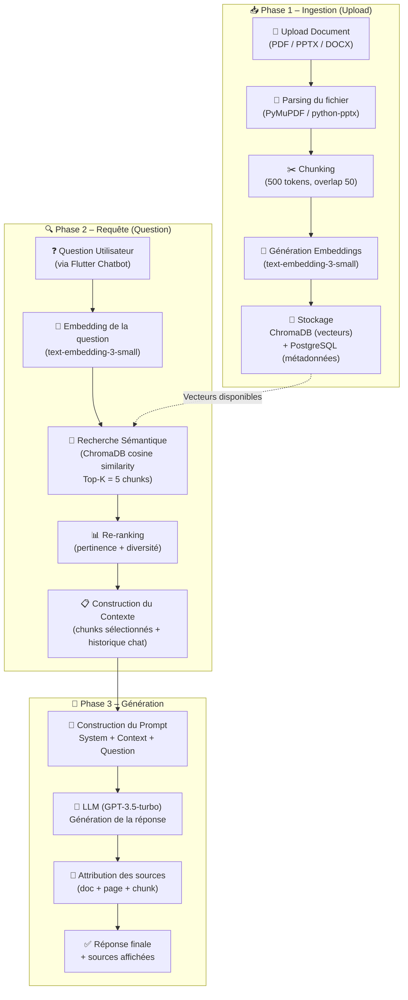

# 🤖 Diagramme de Flux RAG Chatbot – Smart Focus & Life Assistant

**Version** : 1.0  
**Date** : 01 Mars 2026  
**Phase** : Conception  
**Technologies** : LangChain · ChromaDB · OpenAI GPT-3.5/4 · FastAPI

---

## 1. Vue d'Ensemble du Pipeline RAG

