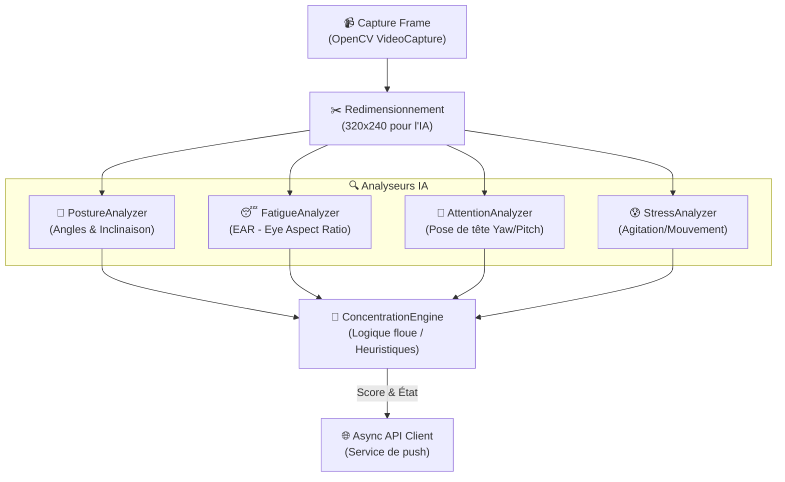
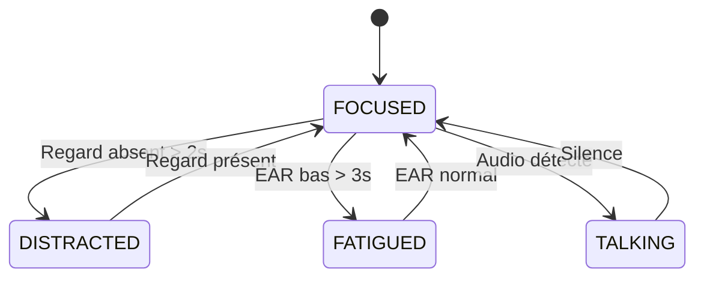

# 🧠 Logique du Module Vision – Smart Focus & Life Assistant

**Version** : 1.0  
**Date** : 08 Mars 2026  
**Description** : Détail du pipeline d'analyse d'images et du moteur de concentration.

---

## 1. Pipeline de Traitement Vision

Le traitement est optimisé pour s'exécuter sur un client (type Raspberry Pi) en temps réel.

---

## 2. Logique du Moteur de Concentration

Le `ConcentrationEngine` agrège les scores des différents analyseurs pour déterminer l'état de l'utilisateur :

- **États détectés** : `focused`, `distracted`, `fatigued`, `talking`.
- **Calcul du score** : Moyenne pondérée tenant compte de la présence du visage, de l'EAR (fatigue) et de l'orientation du regard.
- **Temporisation** : Utilisation de buffers pour éviter les changements d'état trop fréquents (anti-flickering).

---

## 3. Optimisations Techniques

1. **Frame Skipping** : Capture à 30 FPS mais analyse IA toutes les 3 frames (`FRAME_SKIP=3`) pour économiser le CPU.
2. **Multi-threading** : Les appels réseau vers le backend FastAPI sont effectués dans des threads séparés pour ne pas bloquer la boucle de capture.
3. **Calibration Dynamique** : Phase de 5 secondes au démarrage pour définir la posture "normale" de l'utilisateur.
