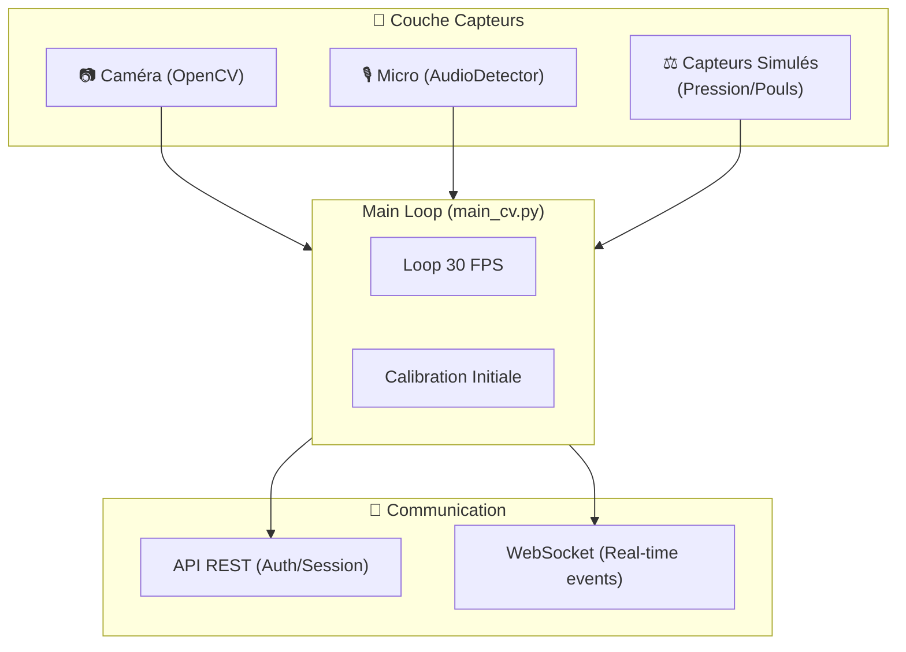
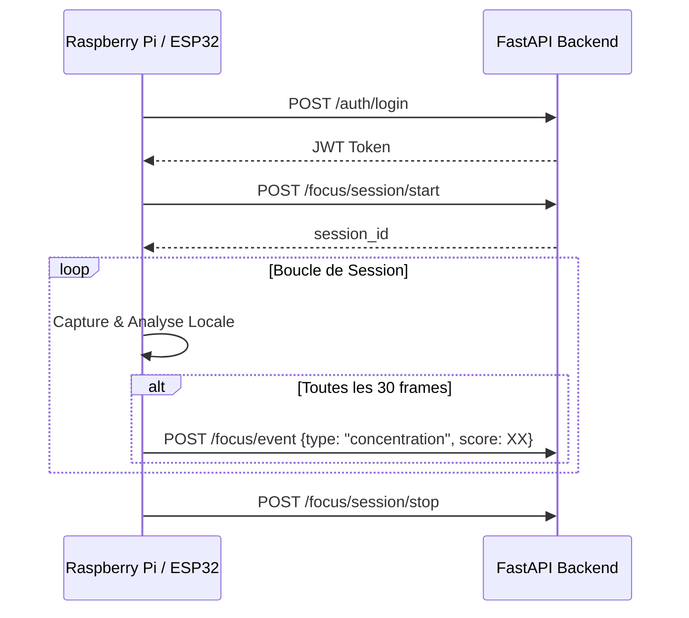

# 📟 Logique Hardware & Client IoT – Smart Focus & Life Assistant

**Version** : 1.0  
**Date** : 08 Mars 2026  
**Description** : Détail du fonctionnement du client IoT (Raspberry Pi/ESP32-CAM) et intégration des capteurs.

---

## 1. Architecture Logicielle du Client (`pi_client`)

Le client est écrit en Python et gère l'orchestration des capteurs et de la caméra.

---

## 2. Intégration des Capteurs

- **Caméra** : Flux MJPEG redimensionné localement.
- **Audio** : Détection de l'activité vocale (VAD) pour identifier les distractions sociales ou les périodes de communication.
- **Capteurs de santé (Simulés)** : Données de pression (présence au bureau) et cardio (simulé pour le prototype PFE).

---

## 3. Flux de Données Hardware → Backend

---

## 4. Gestion des Erreurs & Robustesse

1. **Auto-reconnexion** : En cas de perte de WiFi, le client tente de se reconnecter à l'API sans arrêter la session locale.
2. **Fallback Mode** : Si la caméra n'est pas détectée, le client peut passer en mode "Sensors Only".
3. **Logging** : Logs locaux pour le débogage hardware.
