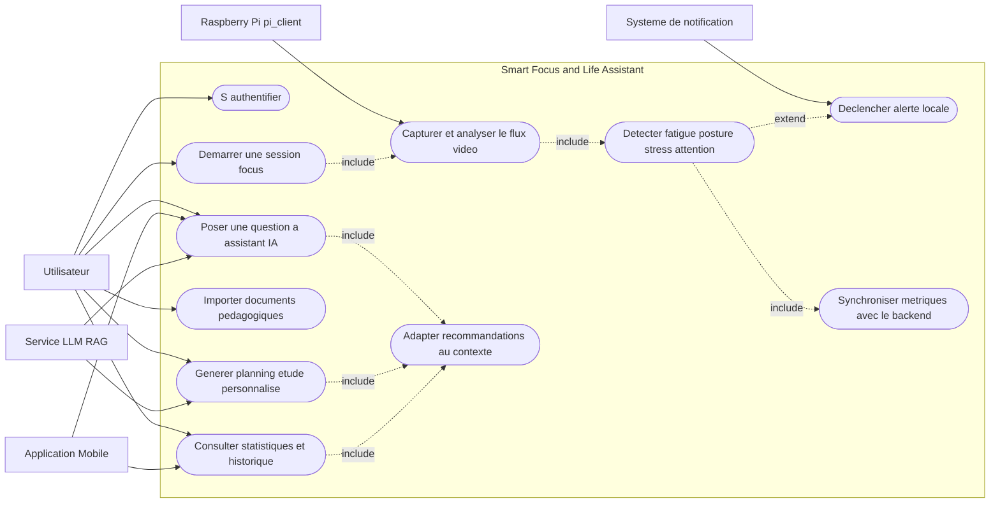

# Diagramme de Cas d'Utilisation Global

## Contexte
Ce diagramme couvre la vue macro du projet Smart Focus & Life Assistant avec les acteurs principaux, les cas d'utilisation coeur et leurs relations.

## Diagramme UML (Mermaid)

## Spécification des Cas d'Utilisation

| ID | Cas d'utilisation | Acteurs | Résultat attendu |
|---|---|---|---|
| UC_AUTH | S'authentifier | Utilisateur | Session utilisateur valide |
| UC_START | Démarrer une session focus | Utilisateur | Session active côté Pi et backend |
| UC_ANALYZE | Capturer et analyser le flux vidéo | Raspberry Pi | Scores mis à jour en continu |
| UC_DETECT | Détecter fatigue/posture/stress/attention | Raspberry Pi | Etat cognitif et physique évalué |
| UC_ALERT_LOCAL | Déclencher alerte locale | Notification, Pi | Alerte écran/LED/vibration envoyée |
| UC_SYNC | Synchroniser métriques avec le backend | Raspberry Pi | Données persistées et exploitables |
| UC_STATS | Consulter statistiques et historique | Utilisateur, Mobile | Dashboard et historique visibles |
| UC_UPLOAD | Importer documents pédagogiques | Utilisateur | Documents indexés pour le RAG |
| UC_CHAT | Poser une question à l'assistant IA | Utilisateur, IA | Réponse contextualisée retournée |
| UC_PLAN | Générer planning d'étude personnalisé | Utilisateur, IA | Planning adapté au profil |
| UC_ADAPT | Adapter recommandations au contexte | IA | Conseils ajustés aux scores et historique |

## Notes de Modélisation

- Les relations <<include>> indiquent un sous-processus obligatoire.
- La relation <<extend>> représente une exécution conditionnelle (seuils critiques atteints).
- Le cas UC_ADAPT centralise la logique de personnalisation IA alimentée par les métriques terrain.
