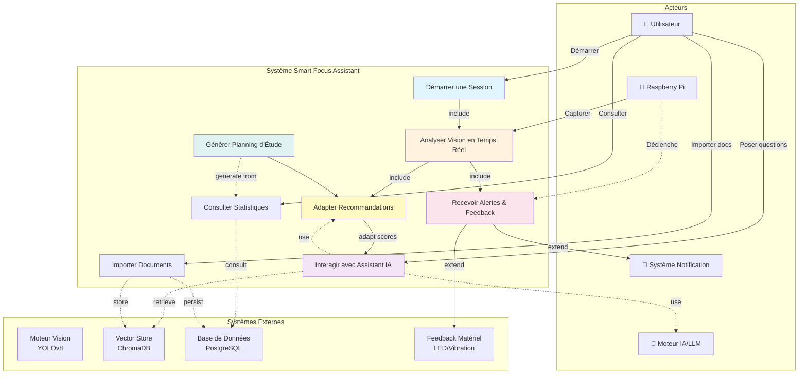

# Diagramme de Cas d'Utilisation Global - Smart Focus Assistant

## Vue Globale du Système

## Description des Cas d'Utilisation

| Cas d'Utilisation | Description | Acteurs | Préconditions |
|-------------------|-------------|---------|---------------|
| **Démarrer une Session** | L'utilisateur lance une session de focus/étude | Utilisateur | L'utilisateur est connecté |
| **Analyser Vision en Temps Réel** | Le pi_client capture et analyse posture, fatigue, stress, attention | Pi, Backend | Session active |
| **Recevoir Alertes & Feedback** | Les alertes sont affichées sur l'écran du Pi et l'app mobile | Système, Utilisateur | Seuil dépassé |
| **Consulter Statistiques** | L'utilisateur visualise l'historique et statistiques sessionnelles | Utilisateur, BD | Sessions enregistrées |
| **Interagir avec Assistant IA** | Chat avec le moteur RAG pour aide à l'étude | Utilisateur, LLM, Vector DB | Documents importés |
| **Générer Planning d'Étude** | IA génère un planning personnalisé basé sur stats | LLM, BD | Données suffisantes |
| **Importer Documents** | Utilisateur importe PDFs/ressources pour le RAG | Utilisateur, Vector DB | Authenticité du fichier |
| **Adapter Recommandations** | Recommandations adaptées selon scores en temps réel | Système, LLM | Scores disponibles |

---

## Relations entre Cas d'Utilisation

- **Include (→)** : Relation de composition obligatoire
- **Extend (⇢)** : Relation optionnelle avec conditions
- **Précédence (⋯→)** : Ordre d'exécution logique
