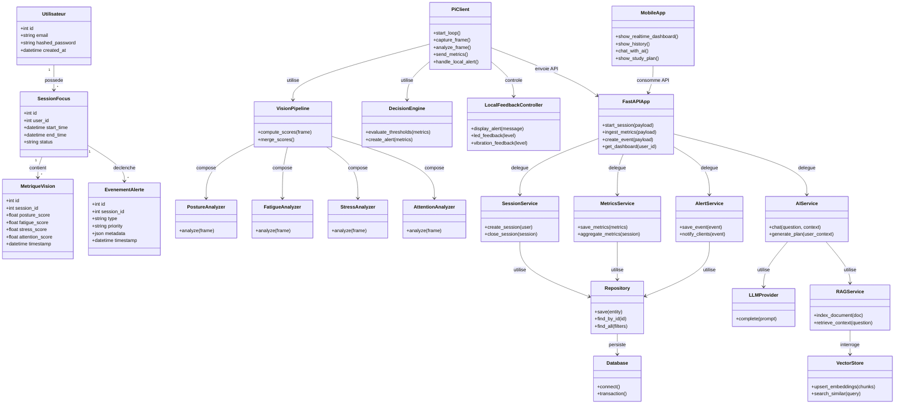

# Diagramme de Classe Global

## Objectif
Ce diagramme représente la structure logique globale du système, en alignement avec les modules réels: pi_client, backend, mobile et composant IA/RAG.

## Diagramme UML (Mermaid)

## Couches UML Globales

| Couche | Eléments |
|---|---|
| Présentation | MobileApp, PiClient, LocalFeedbackController |
| Métier | VisionPipeline, DecisionEngine, SessionService, MetricsService, AlertService, AIService |
| Accès Données | Repository, Database, VectorStore |
| Domaine | Utilisateur, SessionFocus, MetriqueVision, EvenementAlerte |

## Flux Principal Résumé

1. PiClient capture le flux vidéo.
2. VisionPipeline calcule les scores via les analyzers spécialisés.
3. DecisionEngine détermine alertes et priorités.
4. FastAPIApp persiste les données via les services et repositories.
5. MobileApp visualise historique et temps réel.
6. AIService enrichit la recommandation via RAGService et LLMProvider.
