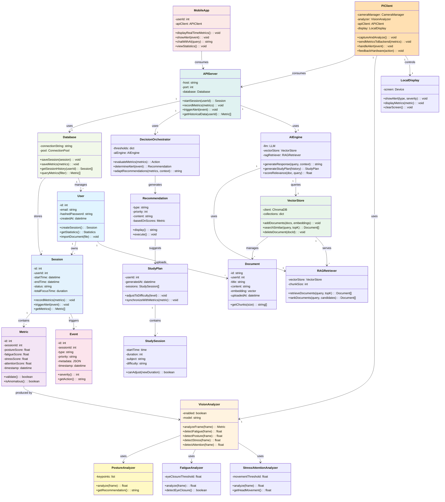

# Diagramme de Classes Global - Smart Focus Assistant

## Modèle Objet Complet du Système



## Hiérarchie et Dépendances

### Couches Identifiées

1. **Couche Présentation** : `MobileApp`, `PiClient`, `LocalDisplay`
2. **Couche Métier** : `APIServer`, `DecisionOrchestrator`, `VisionAnalyzer`, `AIEngine`
3. **Couche Persistance** : `Database`, `VectorStore`, `Document`
4. **Couche Modèle** : `User`, `Session`, `Metric`, `Event`, `Recommendation`

### Flux Principal

```
PiClient (capture) 
  ↓
VisionAnalyzer (analyse)
  ↓
APIServer (traite)
  ↓
DecisionOrchestrator (évalue)
  ↓
AIEngine + RAGRetriever (contexte)
  ↓
Recommendation (affichage mobile & pi)
```
