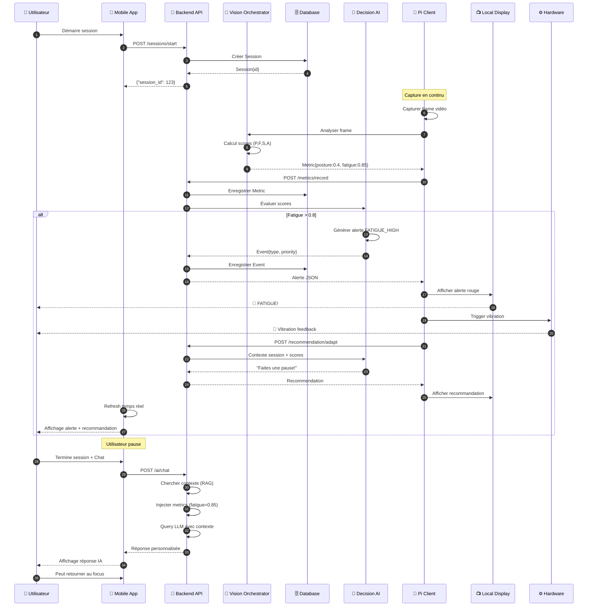
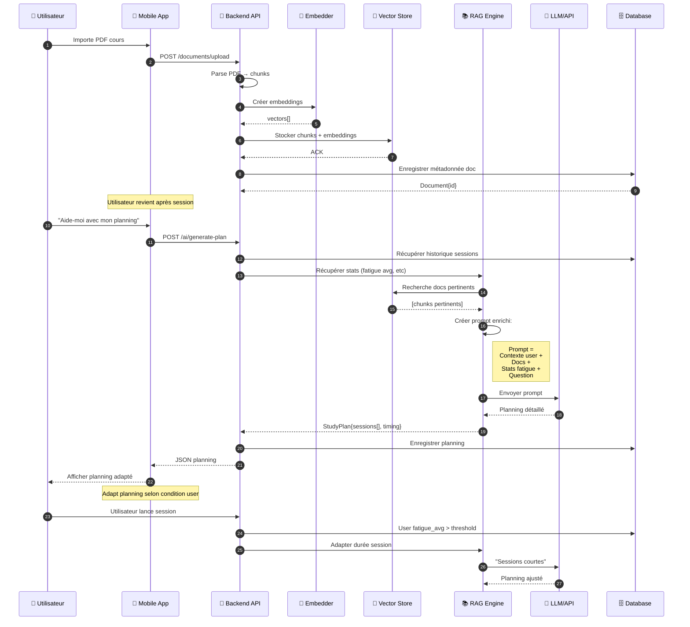
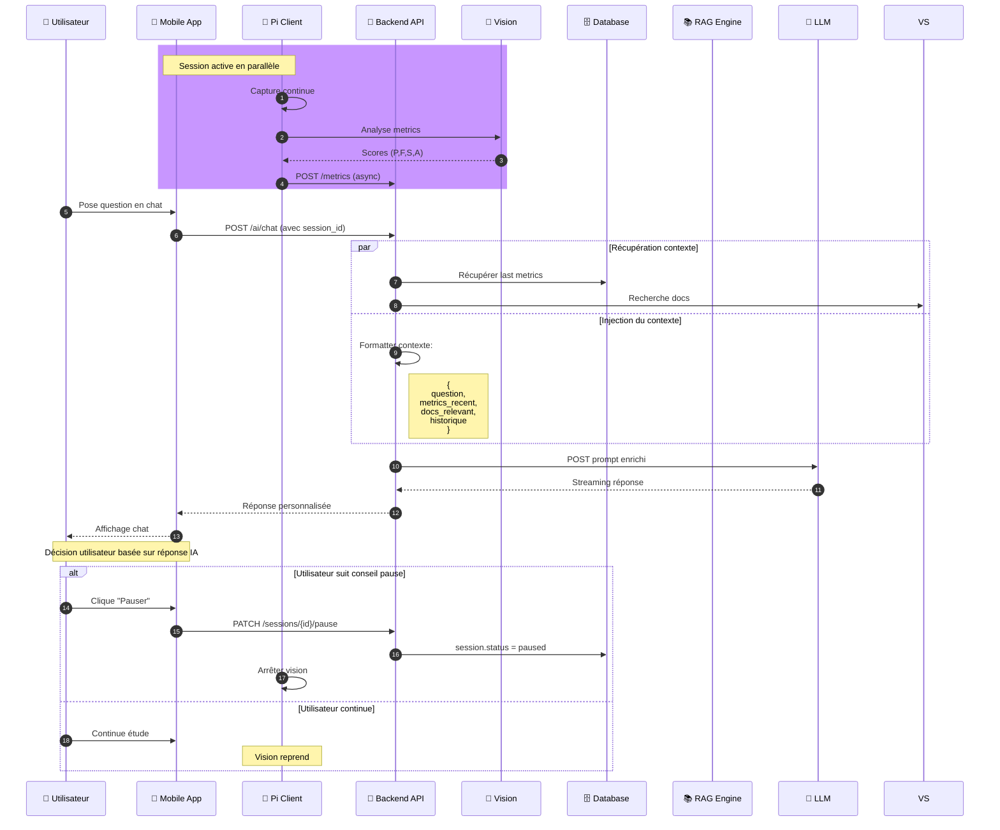
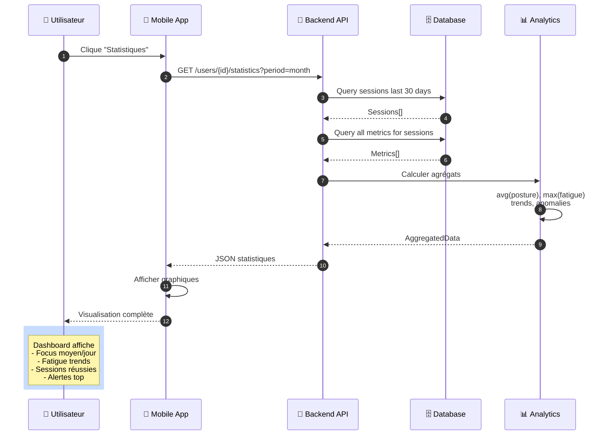

# Diagramme de Séquence Global - Smart Focus Assistant

## Scénario 1 : Session de Focus Complète (Capture + Alerte + Feedback)

---

## Scénario 2 : Importation Document & Génération Planning RAG

---

## Scénario 3 : Interaction Chat Temps Réel En Session

---

## Scénario 4 : Consultation Historique & Statistiques

---

## Notes Importantes

- **Asynchrone** : Les envois de metrics sont POST asynchrones (ne bloquent pas l'app)
- **Real-time** : Vision continue indépendamment du chat
- **Contextualisé** : LLM reçoit toujours context(user, docs, metrics)
- **Adaptatif** : Recommandations évoluent avec les scores
