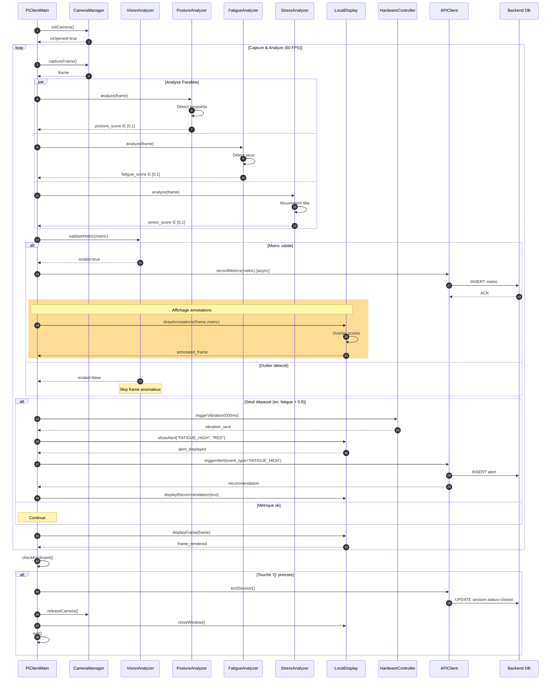
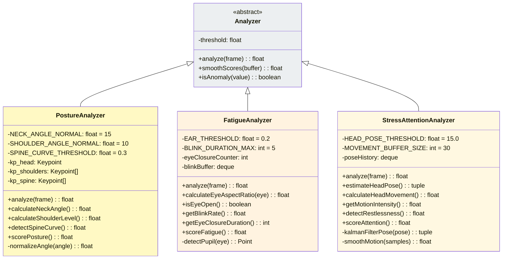

# Module Pi_Client - Diagramme UML Détaillé

## Diagramme de Classes - Module Vision (Pi_Client)

```mermaid
classDiagram
    %% MAIN ENTRY POINT
    class PiClientMain {
        -configPath: string
        -cameraManager: CameraManager
        -visionAnalyzer: VisionAnalyzer
        -apiClient: APIClient
        -eventQueue: queue
        -running: boolean
        +__init__(config)
        +run()
        +shutdown()
        +handleKeyboard()
    }

    %% CAMERA & FRAME CAPTURE
    class CameraManager {
        -cameraId: int
        -isOpened: boolean
        -frameWidth: int
        -frameHeight: int
        -fps: int
        +initCamera(): boolean
        +captureFrame(): Image
        +releaseCamera()
        +getFrameProperties(): dict
    }

    %% DISPLAY MANAGEMENT
    class LocalDisplay {
        -windowName: string
        -isVisible: boolean
        +displayFrame(frame): void
        +drawAnnotations(frame, metrics): void
        +showAlert(title, message, severity): void
        +updateMetricsOverlay(metric): void
        +handleWindowEvents(): void
    }

    %% MAIN VISION ANALYZER
    class VisionAnalyzer {
        -postureAnalyzer: PostureAnalyzer
        -fatigueAnalyzer: FatigueAnalyzer
        -stressAnalyzer: StressAttentionAnalyzer
        -thresholds: dict
        -frameBuffer: deque
        +analyzeFrame(frame): Metric
        +validateMetric(metric): boolean
        +smoothScores(samples, window): float[]
        +detectOutliers(metrics): Metric[]
    }

    %% POSTURE ANALYSIS
    class PostureAnalyzer {
        -poseModel: YOLOv8
        -keypoints: list
        -bodyAngles: dict
        +analyze(frame): float
        +detectKeypoints(frame): Keypoint[]
        +calculateBodyAlignment(): float
        +getErgoRecommendation(): string
        +isGoodPosture(): boolean
        -calculateShoulderAngle(): float
        -calculateSpinalCurve(): float
    }

    class Keypoint {
        -id: int
        -name: string
        -x: float
        -y: float
        -confidence: float
        +isValid(): boolean
    }

    %% FATIGUE ANALYSIS
    class FatigueAnalyzer {
        -eyeDetector: Detector
        -eyeClosureThreshold: float
        -consecutiveFramesThreshold: int
        -eyeClosureFrames: int
        +analyze(frame): float
        +detectFaceRegion(frame): Rect
        +extractEyeROI(face): Image[]
        +detectEyeClosure(): boolean
        +getBlinkRate(): float
        +getFatigueRecommendation(): string
        -calculateEAR(): float
    }

    %% STRESS & ATTENTION ANALYSIS
    class StressAttentionAnalyzer {
        -faceDetector: Detector
        -headPosEstimator: Model
        -movementThreshold: float
        -motionBuffer: deque
        +analyze(frame): float
        +detectHeadMovement(): tuple
        +calculateMovementIntensity(): float
        +estimateAttention(): float
        +detectJawTension(): float
        +getAttentionLevel(): string
        -kalmanFilter(pose): tuple
    }

    %% HARDWARE FEEDBACK
    class HardwareController {
        -gpioPin: int
        -ledColor: string
        -vibrationDuration: int
        +triggerVibration(duration): void
        +changeLEDColor(color): void
        +playSound(frequency): void
        +displayMessage(text): void
        +executeFeedback(action): void
    }

    class LEDController {
        -pins: dict
        -supportedColors: list
        +setColor(color): void
        +blink(color, count): void
        +pulse(color): void
        +off(): void
    }

    class VibrationMotor {
        -pin: int
        -maxDuration: int
        +trigger(duration): void
        +pattern(sequence): void
    }

    %% API COMMUNICATION
    class APIClient {
        -baseUrl: string
        -sessionId: int
        -apiKey: string
        -timeout: int
        +recordMetrics(metric): boolean
        +triggerAlert(event): boolean
        +getRecommendation(): Recommendation
        +startSession(): int
        +endSession(): void
        -makeRequest(method, endpoint, data): Response
        -handleNetworkError(): void
    }

    %% DATA MODELS
    class Metric {
        -sessionId: int
        -postureScore: float
        -fatigueScore: float
        -stressScore: float
        -attentionScore: float
        -timestamp: datetime
        -frameId: int
        +toJSON(): dict
        +validate(): boolean
    }

    class Alert {
        -type: string
        -severity: string
        -metrics: Metric
        -action: string
        +shouldTrigger(): boolean
        +execute(): void
    }

    %% CONFIGURATION
    class Config {
        -configPath: string
        -visionThresholds: dict
        -apiEndpoints: dict
        -hardwareSettings: dict
        +load(): void
        +getValue(key): any
        +validateConfig(): boolean
    }

    %% LOGGING & MONITORING
    class Logger {
        -logFile: string
        -logLevel: string
        +info(message): void
        +warning(message): void
        +error(message): void
        +debug(message): void
        +logMetric(metric): void
    }

    class PerformanceMonitor {
        -fps: float
        -latency: float
        -cpuUsage: float
        +measureFrameTime(): void
        +calculateFPS(): float
        +reportMetrics(): dict
    }

    %% ASSOCIATIONS
    PiClientMain "1" --> "1" CameraManager
    PiClientMain "1" --> "1" VisionAnalyzer
    PiClientMain "1" --> "1" APIClient
    PiClientMain "1" --> "1" LocalDisplay
    PiClientMain "1" --> "1" HardwareController
    PiClientMain "1" --> "1" Logger
    PiClientMain "1" --> "1" Config
    PiClientMain "1" --> "1" PerformanceMonitor

    VisionAnalyzer "1" --> "1" PostureAnalyzer
    VisionAnalyzer "1" --> "1" FatigueAnalyzer
    VisionAnalyzer "1" --> "1" StressAttentionAnalyzer

    PostureAnalyzer "1" --> "*" Keypoint
    
    HardwareController "1" --> "1" LEDController
    HardwareController "1" --> "1" VibrationMotor
    
    VisionAnalyzer "1" --> "*" Metric
    APIClient "1" --> "1" Metric

    style PiClientMain fill:#ffe0b2
    style VisionAnalyzer fill:#fff9c4
    style APIClient fill:#e0f2f1
    style LocalDisplay fill:#f3e5f5
    style HardwareController fill:#fce4ec
```



---

## Diagramme de Séquence - Boucle Principale Pi_Client



---

## Diagramme de Classe - Analyseurs Détaillés



---

## Configuration Exemple (config.yaml)

```yaml
vision:
  model: yolov8n
  input_source: 0  # Caméra USB
  fps: 30
  frame_width: 640
  frame_height: 480

thresholds:
  posture_good: 0.7
  fatigue_warning: 0.7
  fatigue_critical: 0.85
  stress_warning: 0.6
  attention_minimum: 0.5

api:
  base_url: "http://127.0.0.1:8000"
  timeout: 5
  endpoints:
    metrics: "/api/metrics/record"
    alerts: "/api/alert/trigger"

hardware:
  vibration_duration_ms: 500
  led_pin: 17
  display_enabled: true
```

---

## Performance Monitoring

| Métrique | Cible | Critique |
|----------|-------|-----------|
| FPS de capture | 25-30 | < 15 |
| Latence analyse | < 100ms | > 500ms |
| CPU Usage | < 40% | > 80% |
| Mémoire RAM | < 300MB | > 500MB |
| Uptime frame skip | < 1% | > 5% |
