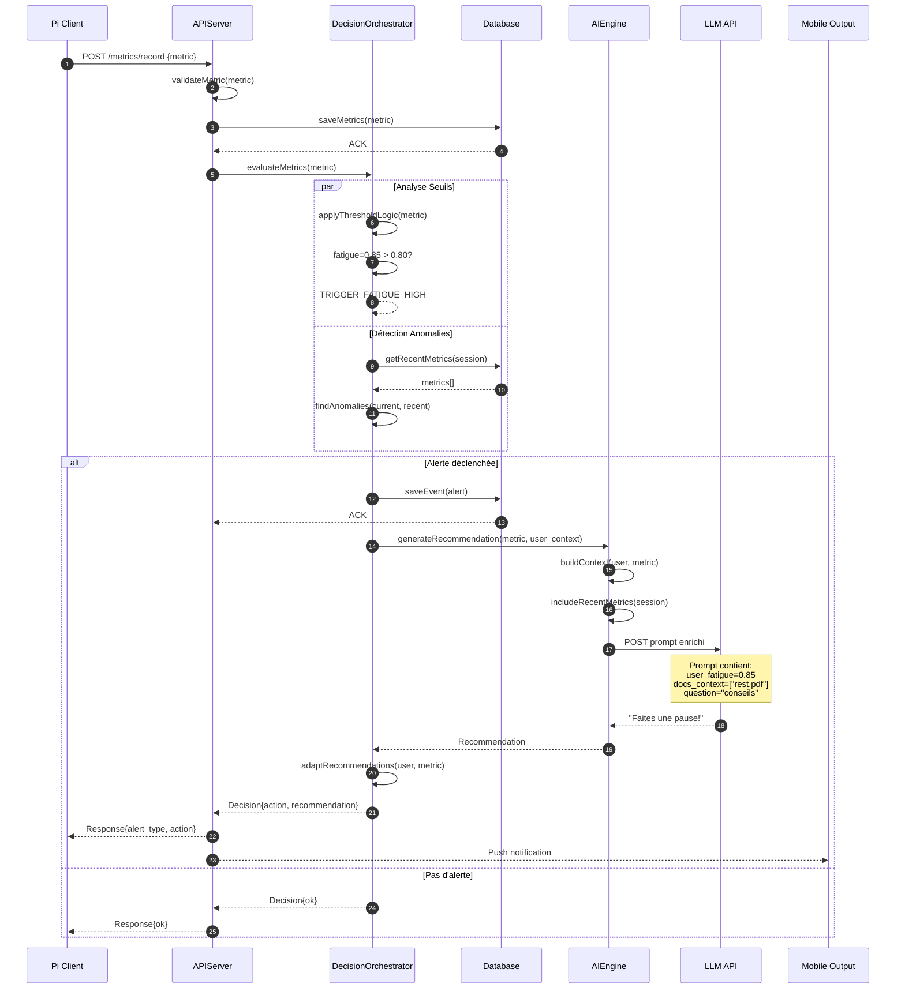

# Module Backend - Diagramme UML Détaillé

## Diagramme de Classes - Module Backend (FastAPI)

```mermaid
classDiagram
    %% ============== MAIN APPLICATION ==============
    class FastAPIApp {
        -app: FastAPI
        -database: Database
        -apiServer: APIServer
        -orchestrator: DecisionOrchestrator
        -aiEngine: AIEngine
        +__init__()
        +startupEvent()
        +shutdownEvent()
    }

    %% ============== API ROUTES ==============
    class SessionEndpoints {
        +POST /sessions/start(user_id): Session
        +POST /sessions/{id}/end: Response
        +PATCH /sessions/{id}/pause: Response
        +PATCH /sessions/{id}/resume: Response
        +GET /sessions/{user_id}/history: Session[]
    }

    class MetricsEndpoints {
        +POST /metrics/record(metric): Response
        +GET /metrics/{session_id}: Metric[]
        +GET /metrics/summary: MetricsSummary
        +DELETE /metrics/{id}: Response
    }

    class AlertEndpoints {
        +POST /alert/trigger(event): Response
        +GET /alerts/{session_id}: Event[]
        +GET /alerts/active: Event[]
        +PATCH /alerts/{id}/acknowledge: Response
    }

    class AIEndpoints {
        +POST /ai/chat(query, context): AIResponse
        +POST /ai/generate-plan(user_id): StudyPlan
        +GET /ai/recommendations: Recommendation[]
        +POST /ai/feedback(rating): Response
    }

    class DocumentEndpoints {
        +POST /documents/upload(file, user_id): Document
        +GET /documents/{user_id}: Document[]
        +DELETE /documents/{id}: Response
        +POST /documents/{id}/process: Response
    }

    class UserEndpoints {
        +POST /users/register(email, password): User
        +POST /users/login(credentials): Token
        +GET /users/{id}/profile: UserProfile
        +PATCH /users/{id}/settings: Response
    }

    %% ============== API SERVER ==============
    class APIServer {
        -host: string
        -port: int
        -database: Database
        -orchestrator: DecisionOrchestrator
        +start()
        +stop()
        +getHealthStatus(): dict
        +recordMetricsWithRateLimit(metric): void
    }

    %% ============== DECISION ORCHESTRATOR ==============
    class DecisionOrchestrator {
        -thresholds: dict
        -aiEngine: AIEngine
        -metricsQueue: PriorityQueue
        -alertHistory: deque
        +evaluateMetrics(metric): Decision
        +determineAlertType(metric): Alert
        +calculateSeverity(metric): int
        +adaptRecommendations(user, metric): Recommendation
        +getContextualAction(state): Action
        -applyThresholdLogic(scores): Alert[]
        -findAnomalies(metric): Anomaly[]
    }

    class Decision {
        -alertType: string
        -severity: int
        -action: string
        -recommendation: string
        -confidence: float
        +toJSON(): dict
        +execute(): void
    }

    class Recommendation {
        -id: string
        -type: string
        -content: string
        -priority: int
        -basedOnMetrics: Metric
        -generatedAt: datetime
        +display(): string
        +validate(): boolean
    }

    %% ============== AI ENGINE ==============
    class AIEngine {
        -llm: LLMClient
        -ragRetriever: RAGRetriever
        -vectorStore: VectorStore
        -contextBuilder: ContextBuilder
        +generateResponse(query, context): string
        +generateStudyPlan(history): StudyPlan
        +adaptToUserState(metrics): Adaptation
        +retrieveRelevantDocs(query): Document[]
        -buildPrompt(query, context): string
        -enrichContextWithMetrics(context, metrics): dict
    }

    class LLMClient {
        -apiKey: string
        -model: string
        -maxTokens: int
        +complete(prompt): string
        +streamResponse(prompt): iterator
        +embedText(text): vector
        -handleRateLimit(): void
    }

    class RAGRetriever {
        -vectorStore: VectorStore
        -rankingModel: Model
        -chunkSize: int
        -topK: int
        +retrieveDocuments(query): Document[]
        +rankDocuments(query, docs): RankedDocuments
        +rerank(query, candidates): Document[]
        +computeRelevance(query, doc): float
    }

    class ContextBuilder {
        -metricsWindow: int = 30
        -maxDocuments: int = 5
        +buildContext(user, query, session): dict
        +includeMetrics(session): dict
        +includeDocuments(docs): dict
        +includeUserHistory(user): dict
        +formatContext(): string
    }

    %% ============== VECTOR STORE ==============
    class VectorStore {
        -client: ChromaDB
        -collections: dict
        -dimension: int
        +addDocuments(docs, embeddings): void
        +searchSimilar(query, topK): Document[]
        +deleteDocument(id): void
        +updateEmbedding(id, vector): void
        +createCollection(name): Collection
    }

    class Document {
        -id: string
        -userId: int
        -title: string
        -content: string
        -chunks: Chunk[]
        -embedding: vector
        -uploadedAt: datetime
        -fileType: string
        +getChunks(size): Chunk[]
        +toEmbedding(): vector
    }

    class Chunk {
        -id: string
        -documentId: string
        -text: string
        -embedding: vector
        -index: int
        +toEmbedding(): vector
    }

    %% ============== DATABASE ==============
    class Database {
        -connection: Pool
        -migrations: list
        +connect(): void
        +disconnect(): void
        +query(sql): Result
        +execute(sql, params): int
        +transaction(operations): void
    }

    class UserRepository {
        +createUser(email, password): User
        +getUserById(id): User
        +getUserByEmail(email): User
        +updateUser(id, data): User
        +deleteUser(id): void
    }

    class SessionRepository {
        +createSession(userId): Session
        +getSession(id): Session
        +getSessionHistory(userId): Session[]
        +updateSessionStatus(id, status): void
        +closeSession(id): void
    }

    class MetricsRepository {
        +saveMetrics(metric): void
        +getMetrics(sessionId): Metric[]
        +getMetricsRange(sessionId, startTime, endTime): Metric[]
        +getAggregated(sessionId): AggregatedMetrics
        +deleteOldMetrics(days): int
    }

    class EventRepository {
        +saveEvent(event): void
        +getEvents(sessionId): Event[]
        +getActiveAlerts(): Event[]
        +acknowledgeEvent(id): void
        +getEventHistory(userId): Event[]
    }

    class DocumentRepository {
        +saveDocument(doc): void
        +getDocument(id): Document
        +getUserDocuments(userId): Document[]
        +deleteDocument(id): void
        +getDocumentByTitle(userId, title): Document
    }

    %% ============== MODELS ==============
    class User {
        -id: int
        -email: string
        -hashedPassword: string
        -createdAt: datetime
        -settings: dict
        +verifyPassword(password): boolean
        +hashPassword(password): string
    }

    class Session {
        -id: int
        -userId: int
        -startTime: datetime
        -endTime: datetime
        -status: string
        -totalFocusTime: int
        +getDuration(): int
        +isActive(): boolean
        +addMetric(metric): void
    }

    class Metric {
        -id: int
        -sessionId: int
        -postureScore: float
        -fatigueScore: float
        -stressScore: float
        -attentionScore: float
        -timestamp: datetime
        +validate(): boolean
        +toJSON(): dict
    }

    class Event {
        -id: int
        -sessionId: int
        -type: string
        -priority: string
        -metadata: JSON
        -timestamp: datetime
        -acknowledged: boolean
        +getSeverity(): int
        +getAction(): string
    }

    class StudyPlan {
        -id: string
        -userId: int
        -generatedAt: datetime
        -sessions: StudySession[]
        -totalDuration: int
        +adjustToDifficulty(level): void
        +getSessions(): StudySession[]
    }

    class StudySession {
        -id: string
        -startTime: time
        -duration: int
        -subject: string
        -resources: Document[]
        +canAdjust(newDuration): boolean
    }

    %% ============== AUTHENTICATION ==============
    class AuthService {
        -secretKey: string
        -algorithm: string
        -tokenExpiration: int
        +generateToken(user): string
        +verifyToken(token): User
        +refreshToken(token): string
        +revokeToken(token): void
    }

    class JWTHandler {
        +encode(payload): string
        +decode(token): dict
        +validate(token): boolean
    }

    %% ============== ASSOCIATIONS ==============
    FastAPIApp "1" --> "1" APIServer
    FastAPIApp "1" --> "1" Database
    FastAPIApp "1" --> "1" DecisionOrchestrator
    FastAPIApp "1" --> "1" AIEngine

    APIServer --> SessionEndpoints
    APIServer --> MetricsEndpoints
    APIServer --> AlertEndpoints
    APIServer --> AIEndpoints
    APIServer --> DocumentEndpoints
    APIServer --> UserEndpoints

    DecisionOrchestrator "1" --> "1" AIEngine
    DecisionOrchestrator "1" --> "*" Decision
    DecisionOrchestrator "1" --> "*" Recommendation

    AIEngine "1" --> "1" RAGRetriever
    AIEngine "1" --> "1" LLMClient
    AIEngine "1" --> "1" ContextBuilder

    RAGRetriever "1" --> "1" VectorStore
    VectorStore "1" --> "*" Document
    Document "1" --> "*" Chunk

    Database "1" --> "1" UserRepository
    Database "1" --> "1" SessionRepository
    Database "1" --> "1" MetricsRepository
    Database "1" --> "1" EventRepository
    Database "1" --> "1" DocumentRepository

    MetricsEndpoints "1" --> "1" MetricsRepository
    SessionEndpoints "1" --> "1" SessionRepository
    AlertEndpoints "1" --> "1" EventRepository
    AIEndpoints "1" --> "1" AIEngine
    DocumentEndpoints "1" --> "1" DocumentRepository

    AuthService "1" --> "1" JWTHandler

    style FastAPIApp fill:#e0f2f1
    style DecisionOrchestrator fill:#f3e5f5
    style AIEngine fill:#f1f8e9
    style Database fill:#fce4ec
```

---

## Diagramme de Séquence - Traitement Métrique → Décision



---

## Points Clés du Module Backend

1. **Asynchrone** : Métriques traitées en arrière-plan
2. **RAG Context** : LLM richeifié avec docs + métriques
3. **Thresholds Adaptatifs** : Peut être réglé par utilisateur
4. **Audit Trail** : Toutes les décisions enregistrées
5. **Rate Limiting** : Protection contre les abus

