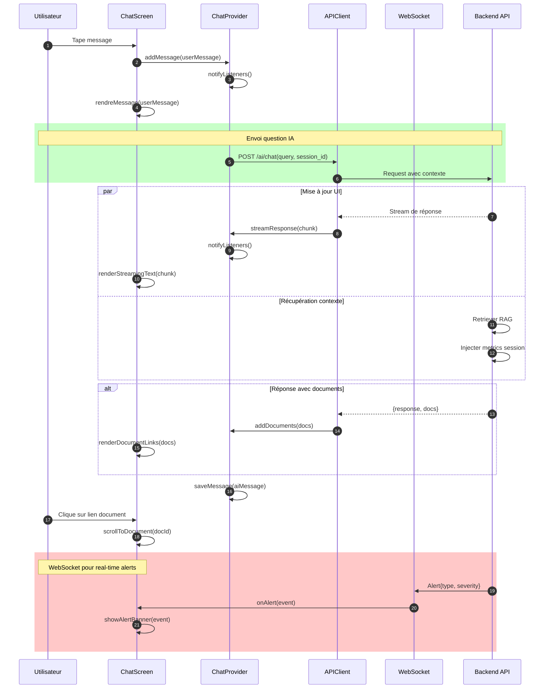
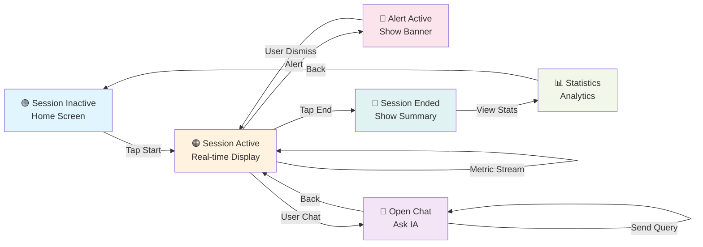

# Module Mobile App - Diagramme UML Détaillé

## Diagramme de Classes - Module Flutter

```mermaid
classDiagram
    %% ============== MAIN APP ==============
    class SmartFocusApp {
        -theme: ThemeData
        -routes: Map
        +build(): Widget
        +setupLocalization()
        +initNotifications()
    }

    %% ============== SCREENS ==============
    class HomeScreen {
        -currentSession: Session
        -realtimeMetrics: Metric
        -alertController: AlertController
        +build(): Widget
        +displayRealtimeMetrics()
        +handleSessionStart()
        +handleSessionEnd()
        +navigateToChat()
    }

    class SessionScreen {
        -sessionId: int
        -metricsStream: Stream
        -displayRefreshRate: int = 500ms
        +build(): Widget
        +updateRealtimeDisplay(metric)
        +renderMetricsChart(metrics)
        +showAlertDialog(event)
        +recordUserFeedback()
    }

    class ChatScreen {
        -userId: int
        -chatHistory: List<Message>
        -apiClient: APIClient
        -scrollController: ScrollController
        +build(): Widget
        +sendMessage(text): void
        +displayStreamingResponse(response)
        +displayDocumentContext(docs)
        +clearHistory(): void
    }

    class StatisticsScreen {
        -userId: int
        -timeRange: DateRange
        -charts: List<Chart>
        +build(): Widget
        +loadStatistics(range): void
        +renderCharts(): void
        +exportData(format): void
        +compareSessionsStats(): void
    }

    class SettingsScreen {
        -thresholds: dict
        -preferences: UserPreferences
        +build(): Widget
        +updateThresholds(): void
        +savePreferences(): void
        +clearCache(): void
        +logout(): void
    }

    class DocumentManagementScreen {
        -documents: List<Document>
        -uploadProgress: float
        +build(): Widget
        +pickAndUploadFile(): void
        +displayUploadProgress(progress)
        +deleteDocument(id): void
        +searchDocuments(query): void
    }

    %% ============== STATE MANAGEMENT ==============
    class SessionProvider {
        -currentSession: Session
        -metrics: List<Metric>
        -events: List<Event>
        +startSession(): void
        +recordMetric(metric): void
        +triggerEvent(event): void
        +endSession(): void
        +notifyListeners()
    }

    class UserProvider {
        -user: User
        -authToken: string
        -preferences: UserPreferences
        +login(email, password): void
        +logout(): void
        +updateProfile(data): void
        +notifyListeners()
    }

    class ThemeProvider {
        -currentTheme: ThemeData
        -isDarkMode: boolean
        +switchTheme(): void
        +getTheme(): ThemeData
    }

    class ChatProvider {
        -messages: List<Message>
        -isLoading: boolean
        +addMessage(message): void
        +removeMessage(id): void
        +clearHistory(): void
        +notifyListeners()
    }

    %% ============== SERVICES ==============
    class APIClient {
        -baseUrl: string
        -token: string
        -dio: Dio
        +startSession(): Session
        +recordMetrics(metric): void
        +chat(query): String
        +getStatistics(userId): Statistics
        +uploadDocument(file): Document
        -createHeaders(): Map
        -handleError(error): void
    }

    class NotificationService {
        -flutterLocalNotifications: Plugin
        +initialize(): void
        +showNotification(title, body): void
        +scheduleNotification(time, data): void
        +cancelNotification(id): void
        +onNotificationClick(handler): void
    }

    class LocalStorage {
        -prefs: SharedPreferences
        +saveUser(user): void
        +getUser(): User
        +saveTheme(theme): void
        +getTheme(): string
        +clear(): void
    }

    class WebSocketService {
        -channel: WebSocket
        -isConnected: boolean
        +connect(url): void
        +onRealtimeMetric(callback): void
        +onAlert(callback): void
        +disconnect(): void
    }

    class FilePickerService {
        -supportedFormats: list
        +pickFile(type): File
        +validateFile(file): boolean
        +compressFile(file): File
    }

    %% ============== UI COMPONENTS ==============
    class MetricsCard {
        -metric: Metric
        +build(): Widget
        +displayScore(score): void
        +colorByScore(score): Color
    }

    class AlertBanner {
        -event: Event
        -severity: int
        +build(): Widget
        +animateIn(): void
        +dismissible: boolean
    }

    class SessionChart {
        -metrics: List<Metric>
        -chartType: string
        +build(): Widget
        +renderChart(): void
        +handleTap(index): void
    }

    class ChatBubble {
        -message: Message
        -isUser: boolean
        +build(): Widget
        +displayText(): void
        +renderDocumentLinks(): void
    }

    class RecommendationCard {
        -recommendation: Recommendation
        +build(): Widget
        +displayAction(): void
        +markAsRead(): void
    }

    class ProgressIndicator {
        -progress: float
        -label: string
        +build(): Widget
        +animateProgress(newValue): void
    }

    %% ============== DATA MODELS ==============
    class Message {
        -id: string
        -sender: string
        -content: string
        -timestamp: datetime
        -hasDocumentContext: boolean
        -isStreaming: boolean
        +toJSON(): map
    }

    class UserPreferences {
        -notificationsEnabled: boolean
        -thresholds: map
        -language: string
        -darkmodeEnabled: boolean
        +toJSON(): map
        +fromJSON(json): UserPreferences
    }

    class Statistics {
        -sessionCount: int
        -totalFocusTime: int
        -averageFatigueScore: float
        -alertCount: int
        -trends: map
        +calculateTrends(): void
    }

    %% ============== ROUTES & NAVIGATION ==============
    class NavigationService {
        -navigatorKey: GlobalKey
        +navigateTo(route): void
        +pop(): void
        +popUntilRoot(): void
        +replaceRoute(route): void
    }

    %% ============== ASSOCIATIONS ==============
    SmartFocusApp "1" --> "1" NavigationService
    SmartFocusApp "1" --> "1" ThemeProvider

    HomeScreen --> SessionProvider
    SessionScreen --> SessionProvider
    SessionScreen --> NotificationService
    SessionScreen --> WebSocketService

    ChatScreen --> ChatProvider
    ChatScreen --> APIClient
    ChatScreen --> UserProvider

    StatisticsScreen --> APIClient
    StatisticsScreen --> SessionChart

    SettingsScreen --> UserProvider
    SettingsScreen --> LocalStorage

    DocumentManagementScreen --> APIClient
    DocumentManagementScreen --> FilePickerService

    SessionProvider "1" --> "*" Metric
    SessionProvider "1" --> "*" Event
    ChatProvider "1" --> "*" Message

    UserProvider "1" --> "1" UserPreferences
    UserProvider "1" --> "1" LocalStorage

    APIClient "1" --> "1" NotificationService
    
    SessionChart "1" --> "*" SessionData
    RecommendationCard --> Recommendation

    style SmartFocusApp fill:#fbe9e7
    style HomeScreen fill:#fff3e0
    style ChatScreen fill:#f3e5f5
    style StatisticsScreen fill:#e0f2f1
    style SessionProvider fill:#f1f8e9
    style APIClient fill:#fff9c4
```

---

## Diagramme de Séquence - Interaction Chat Temps Réel

---

## État Temps Réel Une Session

---

## Points Clés de l'Interface Mobile

1. **Real-Time Updates** : WebSocket pour les métriques
2. **Persistence** : LocalStorage pour cache
3. **State Management** : Provider pattern
4. **Responsive Design** : Adapté à différentes sizes
5. **Offline Mode** : Fonctionne sans connexion (sync plus tard)
6. **Notifications** : Push notifications natives
7. **Performance** : Lazy loading des données

