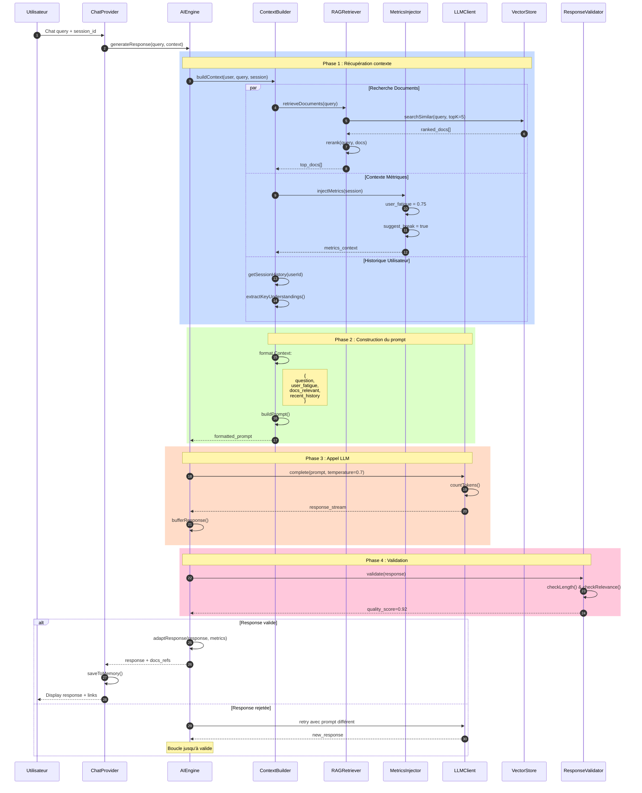
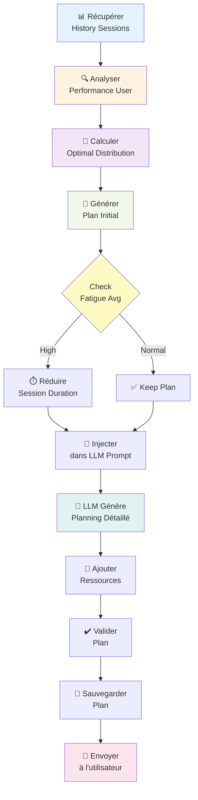

# Module IA/RAG - Diagramme UML Détaillé

## Diagramme de Classes - Moteur IA/RAG

```mermaid
classDiagram
    %% ============== MAIN IA ENGINE ==============
    class AIEngine {
        -llmClient: LLMClient
        -ragRetriever: RAGRetriever
        -contextBuilder: ContextBuilder
        -responseValidator: ResponseValidator
        +generateResponse(query, context): string
        +generateStudyPlan(userHistory): StudyPlan
        +adaptResponse(response, metrics): string
        +scoreConfidence(response): float
        +retrieveContext(query): dict
    }

    %% ============== LLM CLIENT ==============
    class LLMClient {
        -provider: string
        -apiKey: string
        -model: string
        -maxTokens: int
        -temperature: float
        -baseURL: string
        +complete(prompt, params): Response
        +streamCompletion(prompt): Iterator
        +embedText(text): vector
        +countTokens(text): int
        -callAPI(request): Response
        -handleRateLimit(error): void
        -retryOnFailure(request, maxRetries): Response
    }

    class OpenAIClient {
        -apiVersion: string
        +listModels(): list
        +getModelDetails(model): dict
    }

    class GeminiClient {
        -projectId: string
        +streamResponse(prompt): Iterator
    }

    class LLMResponse {
        -content: string
        -tokenUsage: dict
        -finishReason: string
        -model: string
        +getText(): string
        +getTokens(): int
    }

    %% ============== RAG RETRIEVER ==============
    class RAGRetriever {
        -vectorStore: VectorStore
        -chunkManager: ChunkManager
        -rankingModel: RankingModel
        -topK: int
        +retrieveDocuments(query): Document[]
        +rerank(query, candidates): RankedDocuments
        +buildAugmentedContext(query, docs): string
        +scoreRelevance(query, doc): float
        -semanticSearch(query): Doc[]
        -keywordSearch(query): Doc[]
        -fuse(semantic, keyword): Document[]
    }

    class VectorStore {
        -client: ChromaDB
        -collections: dict
        -dimension: int = 1536
        -batchSize: int = 100
        +addDocuments(docs, embeddings): void
        +searchSimilar(query, topK, threshold): Document[]
        +deleteDocument(id): void
        +updateMetadata(id, metadata): void
        +createCollection(name, metadata): Collection
        +deleteCollection(name): void
    }

    class chunkManager {
        -chunkSize: int = 512
        -overlapTokens: int = 50
        +chunkDocument(doc): Chunk[]
        +mergeChunks(chunks): string
        +getMetadata(chunk): dict
        +reorderChunks(chunks, query): Chunk[]
    }

    class RankingModel {
        -modelName: string
        -device: string
        +scoreDocument(query, doc): float
        +rankDocuments(query, docs): RankedDocuments
        +batchScore(queries, docs): matrix
    }

    class Document {
        -id: string
        -userId: int
        -title: string
        -fileType: string
        -chunks: Chunk[]
        -uploadedAt: datetime
        -metadata: dict
        +getChunks(): Chunk[]
        +toEmbeddable(): string
        +validate(): boolean
    }

    class Chunk {
        -id: string
        -documentId: string
        -index: int
        -text: string
        -embedding: vector
        -startOffset: int
        -endOffset: int
        +toEmbedding(): vector
        +getMetadata(): dict
    }

    %% ============== CONTEXT BUILDING ==============
    class ContextBuilder {
        -metricsWindow: int = 30
        -maxDocuments: int = 5
        -maxHistoryLines: int = 10
        +buildContext(user, query, session): dict
        +addMetricsContext(session): dict
        +addDocumentContext(docs): dict
        +addUserHistoryContext(user): dict
        +addSessionState(session): dict
        +formatForPrompt(): string
    }

    class MetricsInjector {
        -weightRecency: float = 0.7
        +injectMetrics(context, metric): dict
        +adaptTone(metrics): string
        +suggestBreak(metric): boolean
        +calculateUserState(metrics): string
    }

    class HistoryManager {
        -maxConversations: int = 50
        -ttl: int = 24*3600
        +getRecentHistory(user): Conversation[]
        +getSessionContext(sessionId): dict
        +pruneOldHistory(user): void
        +summarizeConversation(conv): string
    }

    %% ============== PROMPT ENGINEERING ==============
    class PromptTemplate {
        -systemPrompt: string
        -userTemplate: string
        -contextTemplate: string
        +renderPrompt(variables): string
        +addContext(context): void
        +validatePrompt(): boolean
    }

    class StudyPlanGenerator {
        -templateFile: string
        +generatePlan(userHistory, difficulty): StudyPlan
        +adaptToSchedule(plan, schedule): StudyPlan
        +adjustForFatigue(plan, fatigueScores): StudyPlan
        +estimateDuration(plan): int
    }

    class ResponseAdapter {
        -adaptationRules: dict
        +adaptTone(response, metrics): string
        +adjustDetail(response, userLevel): string
        +injectEmojis(response): string
        +formatForDisplay(response): string
    }

    %% ============== VALIDATION & QUALITY ==============
    class ResponseValidator {
        -minLength: int = 20
        -maxLength: int = 2000
        -qualityThreshold: float = 0.7
        +validate(response): boolean
        +checkToxicity(text): float
        +checkRelevance(response, query): float
        +checkFactuality(response): float
        +generateQualityMeasure(response): dict
    }

    class FeedbackCollector {
        -feedbackStorage: Database
        +recordUserRating(response, rating): void
        +recordUseful(response, useful): void
        +recordImprovement(response, suggestion): void
        +aggregateFeedback(responses): analytics
    }

    %% ============== MEMORY & PERSISTENCE ==============
    class ConversationMemory {
        -conversations: dict
        -maxMemoryItems: int = 100
        +addMessage(sessionId, message): void
        +getConversation(sessionId): Message[]
        +summarize(sessionId): string
        +forget(sessionId): void
    }

    %% ============== ASSOCIATIONS ==============
    AIEngine "1" --> "1" LLMClient
    AIEngine "1" --> "1" RAGRetriever
    AIEngine "1" --> "1" ContextBuilder
    AIEngine "1" --> "1" ResponseValidator

    LLMClient <|-- OpenAIClient
    LLMClient <|-- GeminiClient

    RAGRetriever "1" --> "1" VectorStore
    RAGRetriever "1" --> "1" chunkManager
    RAGRetriever "1" --> "1" RankingModel
    RAGRetriever "1" --> "*" Document

    ContextBuilder "1" --> "1" MetricsInjector
    ContextBuilder "1" --> "1" HistoryManager

    ResponseAdapter "1" --> "1" ResponseValidator
    StudyPlanGenerator "1" --> "1" PromptTemplate

    ResponseValidator "1" --> "1" FeedbackCollector
    AIEngine "1" --> "1" ConversationMemory

    style AIEngine fill:#f1f8e9
    style LLMClient fill:#fff9c4
    style RAGRetriever fill:#e0f2f1
    style ContextBuilder fill:#f3e5f5
    style ResponseValidator fill:#fce4ec
```



---

## Diagramme de Séquence - Génération Réponse RAG Complète



---

## Flux Génération Study Plan



---

## Configuration RAG (Config.yaml)

```yaml
rag:
  vector_store:
    type: chromadb
    persist_directory: ./data/chroma
    collection_name: smartfocus_docs

  retriever:
    top_k: 5
    similarity_threshold: 0.7
    rerank: true

  chunk_manager:
    chunk_size: 512
    overlap_tokens: 50
    min_chunk_size: 100

  context_builder:
    max_documents: 5
    metrics_window: 30
    max_history: 10

llm:
  provider: openai  # ou gemini
  model: gpt-4-turbo
  temperature: 0.7
  max_tokens: 2000
  top_p: 0.95

embeddings:
  provider: openai
  model: text-embedding-3-small
  dimension: 1536

validation:
  min_response_length: 20
  max_response_length: 2000
  quality_threshold: 0.7
```

---

## Métriques de Performance RAG

| Métrique | Cible | Critique |
|----------|-------|-----------|
| Latence retrieval | < 1s | > 3s |
| Latence LLM | < 5s | > 15s |
| Accuracy docs | > 85% | < 70% |
| Response quality | > 0.8 | < 0.6 |
| Token efficiency | < 1500 | > 3000 |

