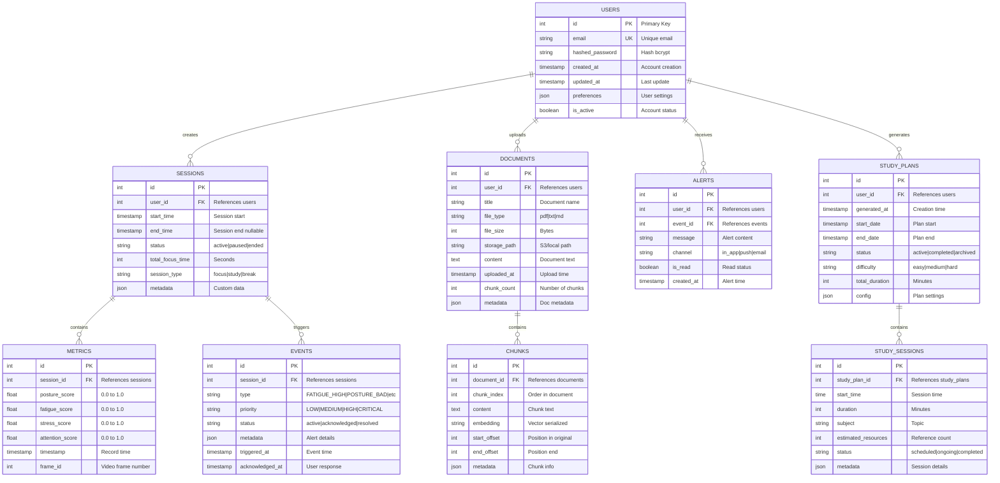
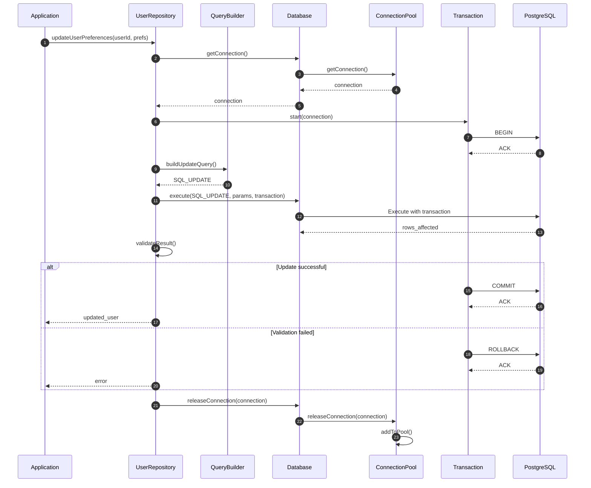

# Module Database - Diagramme UML Détaillé

## Diagramme Entité-Relation (ERD) - PostgreSQL



---

## Diagramme de Classes Repository Pattern

```mermaid
classDiagram
    %% ============== ABSTRACT REPOSITORY ==============
    class BaseRepository {
        <<abstract>>
        #database: Database
        +create(entity): Entity
        +read(id): Entity
        +update(id, data): Entity
        +delete(id): boolean
        +list(): Entity[]
        +query(filters): Entity[]
    }

    %% ============== CONCRETE REPOSITORIES ==============
    class UserRepository {
        +createUser(email, password): User
        +getUserById(id): User
        +getUserByEmail(email): User
        +updateUserPreferences(userId, prefs): void
        +deleteUser(id): void
        +listActiveUsers(): User[]
        +checkEmailExists(email): boolean
        -hashPassword(password): string
        -verifyPassword(plain, hash): boolean
    }

    class SessionRepository {
        +createSession(userId, sessionType): Session
        +getSession(id): Session
        +getSessionsByUser(userId): Session[]
        +getActiveSession(userId): Session
        +updateSessionStatus(id, status): void
        +closeSession(id, endTime): void
        +getSessionByDateRange(userId, start, end): Session[]
        +getSessionStats(userId): SessionStats
    }

    class MetricsRepository {
        +saveMetrics(metrics): void
        +getMetrics(sessionId): Metric[]
        +getMetricsRange(sessionId, start, end): Metric[]
        +getLatestMetric(sessionId): Metric
        +getAggregatedMetrics(sessionId): dict
        +deleteOldMetrics(beforeDate): int
        +getBatchMetrics(sessionIds): dict
        +getMetricHistory(userId, days): Metric[]
    }

    class EventRepository {
        +saveEvent(event): void
        +getEvent(id): Event
        +getEventsBySession(sessionId): Event[]
        +getActiveAlerts(): Event[]
        +getEventsByType(type): Event[]
        +getEventHistory(userId): Event[]
        +acknowledgeEvent(id): void
        +deleteResolvedEvents(): int
        +getEventStats(userId): EventStats
    }

    class DocumentRepository {
        +saveDocument(doc): void
        +getDocument(id): Document
        +getUserDocuments(userId): Document[]
        +searchDocuments(userId, query): Document[]
        +deleteDocument(id): void
        +updateDocumentMetadata(id, metadata): void
        +getDocumentByTitle(userId, title): Document
        +listDocumentsByType(userId, fileType): Document[]
    }

    class ChunkRepository {
        +saveChunk(chunk): void
        +getChunk(id): Chunk
        +getChunksByDocument(docId): Chunk[]
        +getChunksByIds(ids): Chunk[]
        +deleteChunksByDocument(docId): int
        +updateChunkEmbedding(id, embedding): void
        +searchChunks(query): Chunk[]
        +getChunkContext(chunkId, contextSize): Chunk[]
    }

    class StudyPlanRepository {
        +createStudyPlan(userId, config): StudyPlan
        +getStudyPlan(id): StudyPlan
        +getUserStudyPlans(userId): StudyPlan[]
        +updateStudyPlanStatus(id, status): void
        +deleteStudyPlan(id): void
        +getActiveStudyPlan(userId): StudyPlan
        +addStudySession(planId, session): void
    }

    class AlertRepository {
        +saveAlert(alert): void
        +getAlert(id): Alert
        +getUserAlerts(userId): Alert[]
        +getUnreadAlerts(userId): Alert[]
        +markAsRead(id): void
        +deleteAlert(id): void
        +getAlertsByChannel(channel): Alert[]
    }

    %% ============== DATABASE CONNECTION ==============
    class Database {
        -connectionString: string
        -pool: ConnectionPool
        -isConnected: boolean
        +connect(): void
        +disconnect(): void
        +query(sql, params): Result
        +execute(sql, params): int
        +transaction(operations): void
        +getPoolStats(): dict
        -createConnection(): Connection
        -validateConnection(): boolean
    }

    class ConnectionPool {
        -maxConnections: int
        -connections: list
        -available: Queue
        +getConnection(): Connection
        +releaseConnection(conn): void
        +close(): void
    }

    class Transaction {
        -connection: Connection
        -isActive: boolean
        +begin(): void
        +commit(): void
        +rollback(): void
        +executeInsideTransaction(operation): Result
    }

    %% ============== QUERY BUILDER ==============
    class QueryBuilder {
        -tableName: string
        -whereConditions: dict
        -orderBy: list
        -limit: int
        -offset: int
        +select(columns): QueryBuilder
        +where(column, operator, value): QueryBuilder
        +and(column, operator, value): QueryBuilder
        +or(column, operator, value): QueryBuilder
        +orderBy(column, direction): QueryBuilder
        +limit(count): QueryBuilder
        +offset(count): QueryBuilder
        +build(): string
        +execute(): Result
    }

    class FilterBuilder {
        -filters: dict
        +addFilter(field, operator, value): void
        +addDateRange(field, start, end): void
        +addInList(field, values): void
        +build(): dict
    }

    %% ============== DATA MODELS ==============
    class User {
        -id: int
        -email: string
        -hashedPassword: string
        -createdAt: datetime
        -preferences: dict
        +toJSON(): dict
        +validate(): boolean
    }

    class Session {
        -id: int
        -userId: int
        -startTime: datetime
        -endTime: datetime
        -status: string
        -totalFocusTime: int
        +getDuration(): int
        +isActive(): boolean
        +toJSON(): dict
    }

    class Metric {
        -id: int
        -postureScore: float
        -fatigueScore: float
        -stressScore: float
        -attentionScore: float
        -timestamp: datetime
        +average(): float
        +toJSON(): dict
    }

    %% ============== MIGRATIONS & SCHEMA ==============
    class SchemaMigration {
        -version: string
        -name: string
        -SQL: string
        +up(): void
        +down(): void
    }

    class MigrationRunner {
        -migrations: SchemaMigration[]
        +runPendingMigrations(): void
        +getRollbackMigrations(count): void
        +getCurrentVersion(): string
    }

    %% ============== ASSOCIATIONS ==============
    BaseRepository <|-- UserRepository
    BaseRepository <|-- SessionRepository
    BaseRepository <|-- MetricsRepository
    BaseRepository <|-- EventRepository
    BaseRepository <|-- DocumentRepository
    BaseRepository <|-- ChunkRepository
    BaseRepository <|-- StudyPlanRepository
    BaseRepository <|-- AlertRepository

    Database "1" --> "1" ConnectionPool
    Database "1" --> "*" Transaction
    QueryBuilder --> Database
    FilterBuilder --> QueryBuilder

    UserRepository --> User
    SessionRepository --> Session
    MetricsRepository --> Metric

    Database "1" --> "*" SchemaMigration
    MigrationRunner --> SchemaMigration

    style BaseRepository fill:#eceff1
    style Database fill:#fce4ec
    style QueryBuilder fill:#e0f2f1
    style UserRepository fill:#e1f5ff
```



---

## Diagramme de Séquence - Opération CRUD avec Transaction



---

## Stratégie Indexation

```sql
-- Primary Keys (Automatic)
CREATE INDEX idx_users_id ON users(id);

-- Foreign Keys
CREATE INDEX idx_sessions_user_id ON sessions(user_id);
CREATE INDEX idx_metrics_session_id ON metrics(session_id);
CREATE INDEX idx_events_session_id ON events(session_id);
CREATE INDEX idx_documents_user_id ON documents(user_id);

-- Search & Filter Indexes
CREATE INDEX idx_sessions_user_status ON sessions(user_id, status);
CREATE INDEX idx_metrics_timestamp ON metrics(session_id, timestamp);
CREATE INDEX idx_events_type ON events(type);
CREATE INDEX idx_documents_title ON documents(title);

-- Full Text Search
CREATE INDEX idx_documents_content_fts ON documents USING GIN(to_tsvector('french', content));
CREATE INDEX idx_documents_title_fts ON documents USING GIN(to_tsvector('french', title));

-- Performance Optimization
ANALYZE sessions;
VACUUM sessions;
```

---

## Schéma Backup & Recovery

```yaml
backup:
  strategy: incremental_daily
  retention_days: 30
  schedule: "02:00 UTC"
  
  full_backup:
    frequency: weekly
    day: sunday
    retention_days: 90
  
  encryption: true
  storage:
    primary: s3://backup-bucket
    secondary: azure-blob

recovery:
  rto: 1_hour  # Recovery Time Objective
  rpo: 15_minutes  # Recovery Point Objective
  test_frequency: weekly
```

---

## Points Clés de la Base de Données

1. **Normalization** : 3NF pour intégrité
2. **Indexation** : Optimisée pour requêtes fréquentes
3. **Transactions** : ACID compliant
4. **Partitioning** : Métriques par mois
5. **Archivage** : Anciennes données déplacées
6. **Backup** : Quotidien + réplication

