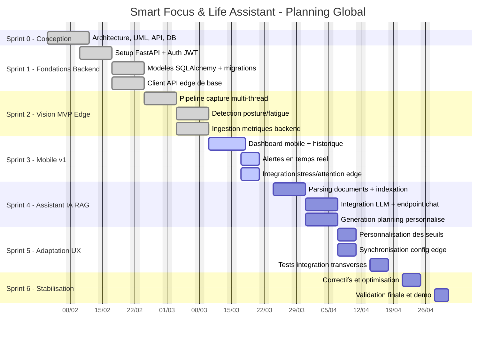

# Diagramme de Gantt Global

## Objectif
Ce diagramme représente le planning global du projet Smart Focus & Life Assistant en cohérence avec le plan Scrum du dossier documentation.

## Diagramme de Gantt (Mermaid)

## Jalons

| Jalon | Date cible | Critere de validation |
|---|---|---|
| M1 - Base technique stable | 2026-02-21 | API auth + DB operationnels |
| M2 - Boucle edge complete | 2026-03-07 | Capture, scoring, alertes, sync |
| M3 - Mobile v1 fonctionnel | 2026-03-21 | Dashboard et historique consultables |
| M4 - IA RAG exploitable | 2026-04-04 | Chat contextualise + planning genere |
| M5 - Integration complete | 2026-04-18 | Flux end-to-end valide |
| M6 - Version demo | 2026-04-30 | Stabilisation et scenario de demo valide |

## Notes

- Les dates sont proposees pour une vue globale et peuvent etre ajustees selon les contraintes académiques.
- Le sprint en cours est marque active.
- Le diagramme est compatible avec les renderers Mermaid de VS Code et GitHub.
