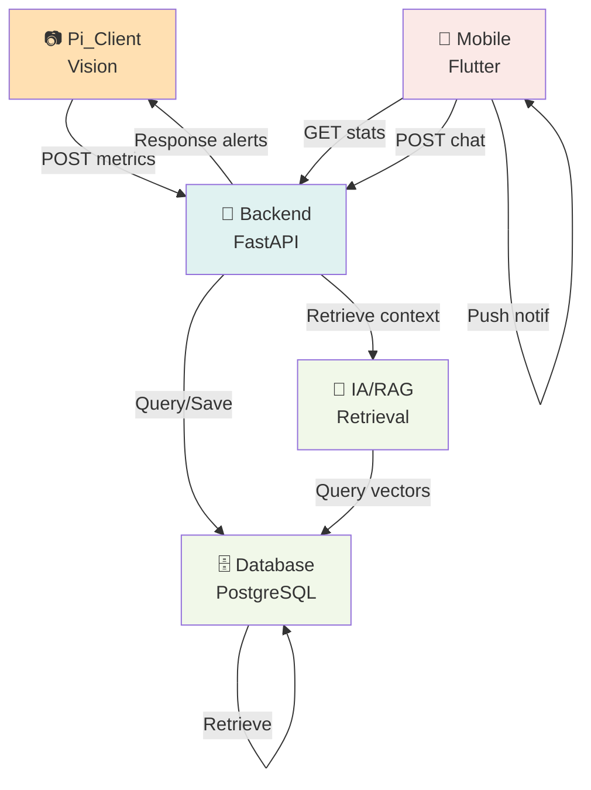

# 📋 Index Complet - Conception UML du Projet Smart Focus Assistant

## 📁 Structure des Fichiers

Ce dossier contient la **conception UML complète** du projet Smart Focus Assistant, organisée en **diagrammes globaux** et **diagrammes par module**.

### 🎯 Vue d'Ensemble

```
uml_design/
├── 01_cas_utilisation_global.md          ← Cas d'utilisation globaux du système
├── 02_diagramme_classe_global.md         ← Architecture classes complètes
├── 03_diagramme_sequence_global.md       ← Flux principaux du système
├── 04_module_pi_client.md                ← Vision analysis (Raspberry Pi)
├── 05_module_backend.md                  ← FastAPI + Décision + IA
├── 06_module_mobile_app.md               ← Flutter Mobile UI
├── 07_module_ia_rag.md                   ← LLM + Vector Store + Context
├── 08_module_database.md                 ← PostgreSQL + Repositories
└── INDEX.md                              ← CE FICHIER
```

---

## 📊 Diagrammes Globaux

### 1️⃣ **[Cas d'Utilisation Global](01_cas_utilisation_global.md)**

**Contenu :**
- 🎯 8 cas d'utilisation principaux du système
- 👤 4 acteurs externes (Utilisateur, Pi, LLM, Email)
- 🔗 Relations include/extend/précédence
- 📝 Description détaillée de chaque cas

**Cas clés :**
- Démarrer une session
- Analyser vision temps réel
- Recevoir alertes & feedback
- Consulter statistiques
- Interagir avec IA via chat
- Générer planning d'étude personnalisé

---

### 2️⃣ **[Diagramme de Classe Global](02_diagramme_classe_global.md)**

**Contenu :**
- 🏗️ 30+ classes du système
- 4 couches architecturales (Présentation, Métier, Persistance, Modèle)
- 📐 Relations d'association et dépendances
- 🔄 Flux principal de traitement

**Classes principales :**
- **Métier** : User, Session, Metric, Event, Recommendation
- **Vision** : VisionAnalyzer, PostureAnalyzer, FatigueAnalyzer
- **Backend** : APIServer, DecisionOrchestrator, AIEngine
- **Persistance** : Database, VectorStore, Document
- **Clients** : MobileApp, PiClient

---

### 3️⃣ **[Diagramme de Séquence Global](03_diagramme_sequence_global.md)**

**Contenu :**
- 4 scénarios complets et annotés
- 📊 Séquences détaillées avec numérotation
- 💬 Interactions parallèles et conditionnelles

**Scénarios :**

| # | Scénario | Acteurs | Description |
|---|----------|---------|-------------|
| 1 | **Session Focus Complète** | Pi, Backend, AI, Mobile | Capture → Analyse → Alerte → Recommandation |
| 2 | **Import Doc + Planning** | User, Backend, VectorDB, LLM | Upload → Embedding → RAG → StudyPlan |
| 3 | **Chat Temps Réel en Session** | User, Mobile, Backend, Vision | Chat parallèle avec vision continue |
| 4 | **Historique & Stats** | User, Mobile, Backend, DB | Consultation des données agrégées |

---

## 🔧 Diagrammes par Module

### 4️⃣ **[Module Pi_Client (Vision)](04_module_pi_client.md)** 📷

**Architecture :**
```
PiClientMain
├── CameraManager (Capture 30 FPS)
├── VisionAnalyzer (Pipeline analyse)
│   ├── PostureAnalyzer (YOLOv8 keypoints)
│   ├── FatigueAnalyzer (Eye detection)
│   └── StressAttentionAnalyzer (Head movement)
├── LocalDisplay (Annotations overlay)
├── HardwareController (LED, Vibration)
└── APIClient (Communication backend)
```

**Composants clés :**
- 🎥 **CameraManager** : Capture vidéo 30 FPS
- 🧮 **PostureAnalyzer** : Détecte 17 keypoints du corps
- 👁️ **FatigueAnalyzer** : Eye closure ratio
- 🎯 **StressAttentionAnalyzer** : Mouvement tête + fidgetiness
- 💡 **HardwareController** : LED + Vibration feedback
- 📡 **APIClient** : Envoi async de métriques

**Performance :**
- Latence analyse : < 100ms
- CPU : < 40%
- FPS capture : 25-30
- Mémoire : < 300MB

---

### 5️⃣ **[Module Backend (FastAPI)](05_module_backend.md)** 🔗

**Architecture :**
```
FastAPIApp
├── APIServer (6 endpoints groups)
├── 6 Route Handlers
│   ├── SessionEndpoints (CRUD sessions)
│   ├── MetricsEndpoints (Métriques)
│   ├── AlertEndpoints (Alertes)
│   ├── AIEndpoints (Chat + Planning)
│   ├── DocumentEndpoints (Gestion docs)
│   └── UserEndpoints (Auth)
├── DecisionOrchestrator (Évaluation seuils)
├── AIEngine (LLM + RAG)
└── Database + Repositories
```

**Flux Principal :**
```
POST /metrics/record
  ↓
validateMetric()
  ↓
DecisionOrchestrator.evaluateMetrics()
  ↓
  ├─ Si seuil dépassé → generateRecommendation()
  └─ AIEngine enrichit avec contexte user
  ↓
Recommendation → Pi + Mobile
```

**Endpoints :**
- `POST /sessions/start` - Démarrer une session
- `POST /metrics/record` - Enregistrer une métrique
- `POST /alert/trigger` - Déclencher alerte
- `POST /ai/chat` - Chat avec IA
- `POST /ai/generate-plan` - Planning étude
- `POST /documents/upload` - Import docs RAG

---

### 6️⃣ **[Module Mobile App (Flutter)](06_module_mobile_app.md)** 📱

**Architecture :**
```
SmartFocusApp
├── Écrans
│   ├── HomeScreen (Dashboard)
│   ├── SessionScreen (Real-time metrics)
│   ├── ChatScreen (Chat IA)
│   ├── StatisticsScreen (Analytics)
│   ├── SettingsScreen (Préférences)
│   └── DocumentManagementScreen (Upload)
├── State Management (Providers)
│   ├── SessionProvider
│   ├── UserProvider
│   ├── ChatProvider
│   └── ThemeProvider
├── Services
│   ├── APIClient
│   ├── WebSocketService (Real-time)
│   ├── NotificationService
│   └── LocalStorage
└── UI Components
    ├── MetricsCard
    ├── AlertBanner
    ├── ChatBubble
    └── SessionChart
```

**Flux d'Interaction :**
1. Home : Dashboard utilisateur
2. Session : Affichage temps réel + alertes
3. Chat : Poser question à l'IA
4. Stats : Consulter historique
5. Docs : Importer ressources

**Real-Time Updates :**
- WebSocket pour métriques
- Push notifications pour alertes
- Streaming LLM pour réponses IA

---

### 7️⃣ **[Module IA/RAG](07_module_ia_rag.md)** 🧠

**Architecture :**
```
AIEngine
├── LLMClient (OpenAI/Gemini)
├── RAGRetriever
│   ├── VectorStore (ChromaDB)
│   ├── ChunkManager (512 tokens)
│   └── RankingModel (Reranking)
├── ContextBuilder
│   ├── MetricsInjector (Scores + État)
│   └── HistoryManager (Conversation)
└── ResponseValidator
    ├── Toxicity check
    ├── Relevance check
    └── Quality scoring
```

**Flux RAG Complet :**
```
Query utilisateur
  ↓
RAGRetriever.search() → Top 5 docs
  ↓
ContextBuilder.buildContext()
  ├─ Document context
  ├─ User metrics (fatigue, etc)
  ├─ Session history
  └─ User profile
  ↓
LLMClient.complete(enriched_prompt)
  ↓
ResponseValidator.validate()
  ↓
ResponseAdapter.adapt(user_metrics)
  ↓
Return → Mobile
```

**Contexte Injected :**
```json
{
  "question": "Aide-moi à réviser",
  "user_fatigue": 0.75,
  "recent_docs": ["doc1.pdf", "doc2.pdf"],
  "session_history": "Focus moyen hier 2h",
  "recommendation": "Courte session (20min)"
}
```

---

### 8️⃣ **[Module Database (PostgreSQL)](08_module_database.md)** 🗄️

**Schéma :**
```
USERS (1:M) SESSIONS
  ├─ id (PK)
  ├─ email (UNIQUE)
  ├─ hashed_password
  └─ preferences (JSON)
    
SESSIONS (1:M) METRICS
SESSIONS (1:M) EVENTS
  ├─ id (PK)
  ├─ user_id (FK)
  ├─ start_time
  ├─ end_time
  └─ status: active|paused|ended

METRICS
  ├─ posture_score: 0-1
  ├─ fatigue_score: 0-1
  ├─ stress_score: 0-1
  ├─ attention_score: 0-1
  └─ timestamp

DOCUMENTS (1:M) CHUNKS
  ├─ id (PK)
  ├─ user_id (FK)
  ├─ title, file_type
  ├─ content
  └─ chunks[] w/ embeddings

STUDY_PLANS (1:M) STUDY_SESSIONS
EVENTS (Events: FATIGUE_HIGH, POSTURE_BAD, etc)
```

**Repositories Pattern :**
- UserRepository
- SessionRepository
- MetricsRepository
- EventRepository
- DocumentRepository
- ChunkRepository
- StudyPlanRepository

**Indexation :**
- PK sur tous les IDs
- FK sur user_id, session_id, document_id
- Performance : timestamp, status, type
- Full-text search sur documents

---

## 🔄 Relations Inter-Modules



---

## 📈 Flux de Données Complet

```
1. CAPTURE (Pi_Client)
   └─→ Caméra USB → Frame vidéo

2. ANALYSE (VisionAnalyzer)
   ├─→ PostureAnalyzer → posture_score
   ├─→ FatigueAnalyzer → fatigue_score
   ├─→ StressAnalyzer → stress_score
   └─→ AttentionAnalyzer → attention_score

3. DÉCISION (Backend - Orchestrator)
   ├─→ Évaluer thresholds
   ├─→ Générer alertes si nécessaire
   └─→ Enrichir avec contexte IA

4. CONTEXTE IA (AIEngine - RAG)
   ├─→ Récupérer docs pertinents
   ├─→ Injecter scores utilisateur
   ├─→ Enrichir prompts LLM
   └─→ Générer recommandation

5. AFFICHAGE
   ├─→ Pi: Écran local + LED
   ├─→ Mobile: App flutter
   └─→ Backend: Logs + BD

6. PERSISTANCE (Database)
   ├─→ Save metrics
   ├─→ Save events
   ├─→ Save recommendations
   └─→ Archive documents
```

---

## 🎯 Conventions UML Utilisées

### Notations
- **Diagramme Classes** (CD) : Mermaid classDiagram
- **Diagramme Séquence** (SD) : Mermaid sequenceDiagram
- **Entité-Relation** (ERD) : Mermaid erDiagram
- **Flux** (Flowchart) : Mermaid graph

### Symboles
- `👤` Acteur externe
- `🔗` Système/Composant
- `📊` Données/Entrée
- `--->` Flux principal
- `..>` Relation optionnelle (extend)
- `--` Réalisation/Implémentation

---

## ✅ Checklist Conception

- ✅ Cas d'utilisation global et par module
- ✅ Diagrammes de classes complets
- ✅ Diagrammes de séquence avec tous les scénarios
- ✅ ERD base de données
- ✅ Flux de données end-to-end
- ✅ Patterns (MVC, Repository, Provider)
- ✅ Indexation et performance
- ✅ Transactions et constraints
- ✅ Real-time communication (WebSocket)
- ✅ Contexte enrichi IA/RAG

---

## 📚 Fichiers Externals Référencés

Voir la documentation complète du projet :
- [Architecture Globale](../01_architecture.md)
- [Cas d'Utilisation](../02_use_cases.md)
- [Conception Base de Données](../05_database_design.md)
- [Modules IA](../06_ai_modules.md)
- [API Contract](../04_api_contract.md)

---

## 🚀 Prochaines Étapes Suggérées

1. **Implémentation Backend** : Utiliser ce design pour coder les routes FastAPI
2. **Optimisation Performance** : Indexer la base selon les patterns identifiés
3. **Tests Unitaires** : Créer des tests pour chaque classe
4. **Documentation API** : Générer Swagger à partir des endpoints
5. **Prototypage Mobile** : Adapter le design Flutter aux écrans réels
6. **Tuning Vision** : Optimiser les thresholds selon l'utilisation réelle

---

## 📞 Responsabilités par Module

| Module | Owner | Dépendances |
|--------|-------|------------|
| Pi_Client | Vision ML | Backend API |
| Backend | API Dev | DB, IA Engine |
| Mobile | Flutter Dev | Backend API |
| IA/RAG | ML Ops | Vector DB, LLM |
| Database | DBA | PostgreSQL |

---

**Création** : Avril 2026  
**Version** : 1.0  
**Status** : ✅ Complet
